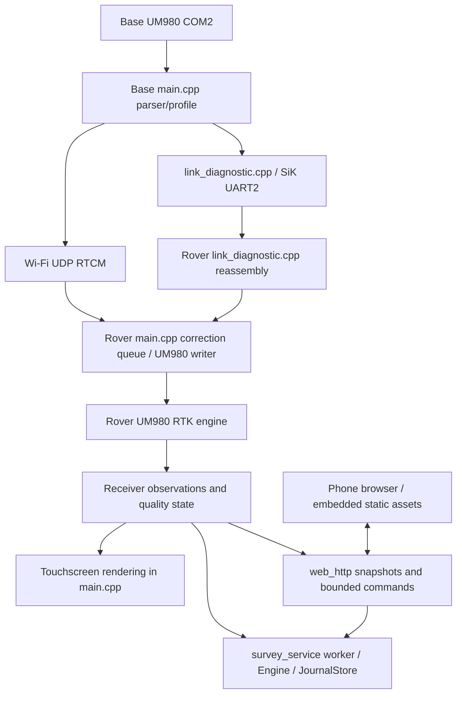

# TopoRTK architecture review and implementation roadmap

**Review date: 2026-09-14.** This is a documentation-only architecture review and future implementation specification. It does not implement or authorize flashing the firmware stages below. The **documented deployed baseline is 0.11.5 on both units**, from dated repository evidence, not a freshly queried device version.

## Scope and recommendation

The requested outcomes are a dedicated web Settings transport selector with truthful result feedback; warned, timed Wi-Fi/Radio tests; automatic dedicated-pair operation and trusted-network takeover without manually matched session/test codes; selected-link-only startup communication; and a sunlight-readable touchscreen.

**Assessment: monolithic orchestration remains, within a partially modularized project.** Preserve the portable correction cores and the separate survey, HTTP, Debug and OTA services. Extract by state ownership, not by moving the same globals into another large file. Start with the parser/test-boundary checkpoint R1, then deliver R2's readability improvement promptly; a complete rewrite is not a prerequisite for a usable screen.

**Existing**, **proposed** and **unvalidated** behavior are distinguished throughout. The implementation roadmap is a set of future, independently executable increments, each requiring its own source change, relevant regression checks and real-hardware acceptance before the next behavioral increment. The outdoor SiK receiver gate remains independent: it can use the known-good firmware without waiting for this refactor.

### Contents

- [Current architecture and accepted baseline](#current-architecture-and-accepted-baseline)
- [Proposed modular architecture](#proposed-modular-architecture)
- [Required behavior and implementation contracts](#required-behavior-and-implementation-contracts)
- [Prioritized implementation roadmap and model assignments](#prioritized-implementation-roadmap-and-model-assignments)
- [Verification](#verification)
- [Critical files and anchors](#critical-files-and-anchors)
- [Assumptions and contingencies](#assumptions-and-contingencies)
- [Source references](#source-references)

## Current architecture and accepted baseline

### Runtime structure — existing

One ESP32-S3/UM980/SiK stack operates at each end. [PROJECT.md, sections 5–6](../PROJECT.md) assigns RTK calculations to UM980 and transport, local display, storage and mobile hosting to ESP32. The phone browser is an interface, never the correction relay or authoritative survey datastore.



Only the selected correction route forwards data. The diagram shows alternative paths, not simultaneous delivery.

| Boundary | Existing implementation and responsibility |
|---|---|
| Receiver | [main.cpp](../firmware/src/main.cpp): UART1/COM2, GGA/RMC/BESTNAV parsing, CRC checks, startup/profile acknowledgement and RTCM input parsing. UM980, not ESP32, solves RTK. |
| Correction safety | [correction_transport.h](../firmware/src/correction_transport.h), [correction_queue.h](../firmware/src/correction_queue.h), [correction_bridge.h](../firmware/src/correction_bridge.h), [correction_health.h](../firmware/src/correction_health.h): whole-frame integrity, station/reference selection, bounded buffers/age, fresh observation and receiver-quality checks. Final UART admission remains in `main.cpp`. |
| Instrument link | Wi-Fi UDP discovery/RTCM in `main.cpp`; SiK UART2 plus diagnostics in [link_diagnostic.cpp](../firmware/src/link_diagnostic.cpp); update hello/notice traffic in [peer_update.cpp](../firmware/src/peer_update.cpp) and [update_notice.h](../firmware/src/update_notice.h). Current formats include RTM1, RTC1 and RTDG. |
| Persistence and survey | [survey_service.cpp](../firmware/src/survey_service.cpp) owns the worker/command queue and serializes SD access; [survey_engine.cpp](../firmware/src/survey_engine.cpp) applies job/quality/occupation rules; [survey_store.cpp](../firmware/src/survey_store.cpp) implements journal storage. NVS stores device/Base settings, phone credentials, diagnostics and OTA receipts in separate namespaces. |
| Browser/HTTP | [web_http.cpp](../firmware/src/web_http.cpp) serves flash-resident assets, enforces origin/bearer checks and queues typed work. The pages and scripts are canonical sources under [firmware/web/](../firmware/web/) described by [assets.json](../firmware/web/assets.json); `api.js` is the single controller client and `navigation.js` the shared page navigation (R7). |
| Instrument UI | `main.cpp` owns rendering, state formatting, FT6336 input and backlight; [touch_layout.h](../firmware/src/touch_layout.h) already shares drawing/hit-test geometry. |
| Updates | [ota_service.cpp](../firmware/src/ota_service.cpp), [update_package.h](../firmware/src/update_package.h), `peer_update.cpp`: guarded inactive-slot upload, paired notices and deferred boot acceptance. These are not a general pair-management service yet. |

### Verified concentration and coupling

At review, `main.cpp` is **2,806 lines**. It directly owns hardware startup, shared mutable state (lines 171–350), NVS settings, GNSS ASCII/RTCM parsing and profile control, Wi-Fi discovery/RTCM transport, correction output queues and freshness, CSV logging, touchscreen input/rendering/brightness, status serialization, USB commands and application service ordering.

Concrete coupling, with line numbers as review-time hints rather than permanent anchors:

- `start_wifi` (612–656) also revokes browser control, clears the Base reference, resets correction queues/counters and restarts the phone AP.
- `select_config` (659–688) persists role/network settings and drives receiver profile changes.
- `handle_line` (2245–2331) mixes parser results, profile acknowledgement, display state and logging.
- `loop` (2775–2806) directly orders every subsystem.
- `read_gnss` (2396–2424) and `receive_wifi_packets` (710–781) drain input without a fixed per-call budget. Optional CSV append synchronously flushes/closes storage (1415–1424). These are **latency/ownership risks, not measured field failures**.

Status drift is visible: dashboard/survey freshness use `verified_correction_age`, but CSV state logging still calls Wi-Fi-only `peer_linked` and records arrival age/RSSI through the historical Wi-Fi path (1459–1487, 1565–1608). A shared transport-aware snapshot is a concrete improvement. A green connection indicator must not substitute for RTK quality or survey eligibility.

Other concentrations are defined by responsibility, not physical line count:

- `link_diagnostic.cpp` is **302 lines**, but owns UART2, diagnostic UDP, live corrections, three wire formats, request processing, NVS reports, ATI probes and JSON snapshots.
- `survey_ui.h` and `survey_tools_ui.h` contain **28,219 and 29,715 bytes** of densely packed embedded HTML/JavaScript. The latter repeatedly replaces global `render`, `controls`, `switchTab` and collection handlers (16–18, 43–45, 52–54, 72–74, 79, 92). [ota_ui.h](../firmware/src/ota_ui.h), line 16, similarly wraps Debug controls. *Superseded 2026-09-15: those headers are deleted, the sources are the canonical `firmware/web/` files, and `api.js`/`navigation.js` replace the per-page token plumbing and the injected Debug tab.*
- The HTTP server registers **22 routes with `max_uri_handlers = 22`** (`web_http.cpp:229,235–257`), leaving no slots for Settings. Added assets/API handlers require capacity derived from their actual route tables. *Superseded 2026-09-15: `max_uri_handlers` is derived from the generated asset table plus the API route table.*
- [test/run_host_tests.py](../firmware/test/run_host_tests.py), lines 14–52, concatenates source files and regex-strips hardware headers; browser tests extract C++ raw strings. Moving code without moving these verification boundaries would preserve fragile tests.

### Existing access, bootstrap and diagnostic behavior

Trusted takeover already exists: `/api/v1/control` accepts `{client}`, returns a bearer and uses a **120-second renewable lease**, without a PIN. The explicit matching values are the six-digit diagnostic `run` and live SiK `session`; neither is an access credential. Keep same-origin checks, single-controller authorization and typed commands.

[rover_ap.cpp](../firmware/src/rover_ap.cpp), lines 25–43 and 73–111, already implements hardware-triggered phone-key replacement with NVS readback. `main.cpp:2082–2115` supplies the touchscreen path. Preserve hardware-only reveal/rotation rather than inventing a web password endpoint.

Selected-link startup is incomplete. `peer_update_receive` rejects a route/session mismatch (`peer_update.cpp:22–32`), and the live radio parser runs only inside `if(live.active())` (`link_diagnostic.cpp:233–252`). The existing TPH1 challenge/echo cannot bootstrap the very session needed to receive it. Peer freshness is transport connectivity; OTA recovery separately depends on receiver quality. New pairing must separate those states.

The diagnostic engines already provide countdowns, finite arm/run/result phases and NVS-retained results. Settings tests need automatic coordination, temporary route ownership and restoration, not a second packet-test engine. The existing “switch corrections to Wi-Fi before diagnostics” branch (`link_diagnostic.cpp:211`) must be removed by the ownership coordinator, not merely hidden in the page.

### Existing display evidence

The reported inability to read the physical screen at maximum brightness is the problem; brightness alone is not its solution. In-memory calculations using the actual RGB565 components give:

- Old white-on-ready-green: approximately **5.039:1**, above WCAG AA normal-text contrast but below the proposed 7:1 important-text target.
- Old border/panel: **2.405:1**, below the proposed 3:1 meaningful-boundary target.
- Old muted/panel text: **12.742:1**; not every existing text color is low contrast.

The stronger evidence is size-1 instructions/titles, automatic shrink-to-size-1, weak control boundaries and the reported field failure. `draw_label_value` already uses size 2; not every detail label is tiny. Software contrast targets are not outdoor panel certification.

### Accepted evidence and unvalidated outcomes

The **documented 0.11.5 baseline** includes bench acceptance of the existing instrument survey features, a previous open-sky Wi-Fi FIXED session, real-receiver indoor SiK forwarding and deliberate OTA rollback/watchdog/interrupted-upload paths. Historical integration-pending notes in PROJECT.md are not evidence that the production bridge is still absent; current correction modules and later dated SiK evidence establish its existence. Do not rewrite the historical notes as part of this review.

Baseline references:

- [Real-receiver SiK bench session, 2026-09-14](../tests/2026-09-14-sik-bench/README.md).
- [Rollback and interruption acceptance, 2026-09-14](../tests/2026-09-14-rollback-acceptance/README.md).
- [Debug-default-on deployment, 2026-09-14](../tests/2026-09-14-debug-default-on/README.md).
- [Instrument/Android responsibility split and instrument feature outcome](esp32-android-feature-split.md).

These records **do not establish** outdoor SiK FIXED/recovery/range, independent survey accuracy, complete field power qualification or the requested sunlight improvements. Bench evidence is not field qualification.

### Issues and recommended treatment

| Priority | Verified issue | Treatment |
|---|---|---|
| P0 | Manual session/test matching; radio bootstrap requires an existing live session | Introduce a transport-independent pair/session state machine receiving bootstrap control before correction selection. |
| P0 | Tests and live SiK share one owner with a Wi-Fi-first restriction | Give UART/transport ownership to a link service; let tests temporarily reserve it and restore corrections automatically. |
| P0 | Queue acceptance is not applied/connected state; no correlated Settings outcome | Add one operation ID and authoritative progress/result snapshot. A connection popup follows a validated peer exchange, not HTTP 202 or GNSS FIXED. |
| P0 | Field text unreadable at maximum brightness | Extract the UI seam and apply the light/high-contrast layout below; verify on the actual panel outdoors. |
| P1 | `main.cpp` and `link_diagnostic.cpp` combine hardware, policy, rendering and persistence | Extract by state ownership; maintain one writer per UART, one place for link-operation arbitration and explicit read-only snapshots. |
| P1 | Wi-Fi-only labels/counters survive in CSV, GPS/Link details and web descriptions | Consume a shared transport-aware snapshot while keeping connectivity, correction freshness and survey readiness separate. |
| P1 | Repeated JS monkey-patching, duplicated token clients, fully used HTTP route table | Use readable feature assets, one client and explicit lifecycle calls; derive URI capacity from actual tables. |
| P1 | Source-concatenating tests couple verification to file layout | Compile extracted production modules against test hardware adapters; serve the same canonical browser assets used for embedding. |
| P2 | Unbounded GNSS/Wi-Fi drains and synchronous optional CSV writes can delay the cooperative loop | Add bounded service budgets after behavior-preserving extraction; move best-effort CSV flushes off the correction loop with finite storage and explicit drop counters. Preserve durable survey commits. |
| P2 | Important capabilities are bench-qualified, not survey/field-qualified | Preserve outdoor SiK and independent-control gates; postpone Android/COGO/import expansion until prerequisites are proved. |

## Proposed modular architecture

Use ordinary `.h/.cpp` services, fixed-size value snapshots and explicit calls. Do not create a generic event bus, plugin framework, thin-wrapper collection or an `AppContext` containing all the old globals. Main-loop owners mutate receiver/link state; HTTP/UI readers receive copied snapshots, never pointers to mutable queues.

The following are **proposed new paths**, except where explicitly marked existing. Paths are relative to `firmware/`. Introduce each only in the stage that gives it a real owner and consumers.

| Owner / target | Move or reuse | Public boundary and dependency rule |
|---|---|---|
| `src/board_hardware.h/.cpp` | Board pins, display/touch initialization and hardware construction from `main.cpp:45–73,171–179,2693–2726` | Own physical devices; expose initialization/health, not domain policy. Preserve GPIOs, baud, buffer sizes and startup sequence at extraction. |
| `src/gnss_parser.h/.cpp` | `GgaData`, `HorizontalAccuracyData`, `GnssTimeData`; checksum/coordinate helpers and `parse_gga`, `parse_rmc_time`, `parse_bestnav_accuracy` | Explicit time/counter inputs; no Arduino, display, NVS or logging dependency. Preserve accepted/rejected input behavior. |
| `src/gnss_service.h/.cpp` | `read_gnss`, `handle_line`, startup/profile sequencing and receiver state from `main.cpp:2245–2533` | Sole UART1 owner. Publish `GnssSnapshot`; accept typed profile requests and whole RTCM frames. Preserve allowlisted receiver commands and acknowledgement-before-profile-verified semantics. |
| `src/device_settings.h/.cpp` | `load_config`, `save_config`, `load_base_settings` and typed settings application | Preserve `toportk/config`, `topobase/settings` and `DeviceConfig` encodings; readback failure means not applied. Link preference belongs to link service, not a duplicated Wi-Fi-mode bit. |
| `src/correction_service.h/.cpp` | Station/reference capture, `queue_correction`, `service_correction_output`, correction health and output statistics | Own bounded COM2 queue/reference/freshness; reuse portable cores. Only the selected production session may submit; synthetic test data never calls this service. |
| `src/network_service.h/.cpp` | AP/STA lifecycle, `start_wifi`, station reconnects; retain existing `rover_ap.cpp` as phone-AP implementation | Network lifecycle does not reset GNSS, correction history or radio sessions. Role/receiver changes explicitly request their own resets. Phone AP remains usable without Base association. |
| `src/wifi_transport.h/.cpp`, `src/radio_transport.h/.cpp` | Production/test UDP and the single `HardwareSerial(2)` owner currently in diagnostics | Bounded packet RX/TX/availability and transport statistics. No jobs, UI, NVS transactions or test policy. One envelope framer consumes a complete CRC-valid packet before type dispatch. |
| `src/pair_session.h/.cpp`, `src/link_service.h/.cpp` | Extract TPH1 discovery from `peer_update.cpp`; reuse fresh-session and notice retry/tombstone patterns | Pair/session core owns boot negotiation. Link service owns chosen transport, live bridge, operation reservation, persistent preference and temporary test restoration. `peer_update.cpp` consumes established peer/session state and retains OTA-specific quality-confirmed recovery. |
| Existing `src/link_diagnostic.cpp` | Native engines, ATI probe policy and NVS result persistence | Lose UART/UDP/live-route ownership. All starts/cancels use link-operation reservation; engines remain autonomous after browser disconnect. |
| `src/instrument_status.h/.cpp` | `gps_required_fix`, link/freshness status, dashboard warning selection and status serialization inputs | One `InstrumentStatus` with distinct network/peer/correction/GNSS facets. LCD, HTTP and CSV consume it. `Engine::quality` remains separate job-dependent collection authority. |
| `src/ui_theme.h`, `src/ui_display.h/.cpp`, `src/ui_screens.h/.cpp`, `src/touch_input.h/.cpp` | Palette/primitives/cache, screen functions, touch state machine and backlight from `main.cpp` | Render snapshots; emit typed actions to owners. Retain `touch_layout.h` as sole hit-rectangle definition. Renderers never call NVS, receiver UART or transport mutation directly. |
| `src/diagnostic_log.h/.cpp` | Optional CSV session/events/solution logging from `main.cpp:1415–1608` | Separate from authoritative survey journal; consume snapshots and share existing SD mutex. Bounded best-effort queue, not an unbounded logging service. |
| Existing `src/main.cpp` | `setup`/`loop` composition and service ordering only | Target a short composition root, approximately 100–200 lines, not a size quota achieved by moving the monolith into `app.cpp`. |

### First extraction contract and callsites

For the first low-risk seam, introduce the following **proposed** parser boundary:

```cpp
struct GnssParseStats { uint32_t checksum_errors = 0; };

bool parse_gga(const char *line, GgaData &result, GnssParseStats &stats);
bool parse_rmc_time(const char *line, uint32_t now_ms,
                    GnssTimeData &result, GnssParseStats &stats);
bool parse_bestnav_accuracy(const char *line, uint32_t now_ms,
                            HorizontalAccuracyData &result, GnssParseStats &stats);
```

Move existing helper bodies, preserving parsing policy and fixed local buffers. Replace `millis()` with `now_ms` and the global checksum increment with `stats.checksum_errors`. Update `main.cpp::handle_line` and [test/firmware_cases.h](../firmware/test/firmware_cases.h); remove original definitions, not retain forwarding aliases. A repository search for `parse_gga\(|parse_rmc_time\(|parse_bestnav_accuracy\(` within this firmware's `src` and `test` identifies consumers. Separately compile the parser and feed it the existing BESTNAV valid/invalid/CRC fixtures. Later `gnss_service` takes main-side ownership without changing the parser again.

`main.cpp::read_gnss` also increments the current `checksum_errors` on line overflow. Move that use to the same main-owned `GnssParseStats` instance so extraction neither loses nor double-counts errors; remove the old standalone counter. Overflow handling belongs to the receiver owner, not the pure line parser. Verified consumers are the three calls in `handle_line` and BESTNAV cases in `test/firmware_cases.h`; repeat the search at execution to include concurrent additions.

For later extracted exports, use symbol references when an LSP is available; otherwise locate every declaration/callsite with repository search before moving. Keep externally consumed `correction_radio_*`, `peer_update_*` and `survey_*` consumers compiling within each checkpoint, then replace obsolete APIs and migrate all consumers in the same feature cutover. Do not leave compatibility layers in the final tree.

### Browser source organization — proposed

Use readable browser source files, not another generated global-wrapper layer. Add the following proposed files within the firmware directory:

- `web/status.html`, `web/survey.html`, `web/diagnostics.html`, `web/debug.html`.
- `web/common.css`, `web/api.js`, `web/navigation.js`.
- `web/status.js`, `web/survey.js`, `web/points.js`, `web/settings.js`, `web/diagnostics.js`, `web/debug.js`, `web/update.js`.

`survey.html` owns the existing survey/Points forms plus the Settings panel. `navigation.js` has one explicit route table and dispatches `mount/render/setEnabled` to feature modules; no assignments replace another module's `render`, `controls`, `switchTab` or form handler.

Retain offline instrument-hosted operation: no SPA framework, CDN, cloud or Android APK. Introduce one deterministic Python standard-library embedder, `tools/embed_web_assets.py`, integrated by a PlatformIO pre-build hook. It reads one `web/assets.json` path/MIME/source manifest and generates flash-resident byte arrays and route descriptors into the **per-environment build directory**, avoiding parallel Unit A/B build collisions. Missing files, duplicate URLs or unsupported MIME entries fail the build. Embed unminified content initially; source organization does not require a bundler.

Register generated static assets and explicit API handlers using a total derived from both tables before starting `httpd`; the existing 22-handler capacity is full. Tests read/serve the same `web/` sources and manifest rather than splitting C++ string delimiters. Preserve public page URLs `/`, `/ui/v1/`, `/survey`, `/diagnostics`, `/debug`; update all internal script paths in one asset cutover. Remove obsolete embedded UI headers and old JS routes after every caller/test has moved.

The shared browser client stores one per-origin session identity/token (`topoClient`, `topoToken`) and handles `X-Controller`, stale snapshots, 401 and duplicate-safe command IDs consistently. Stop reading/writing `surveyClient/surveyToken`, `diagnosticClient/diagnosticToken` and `debugClient/debugToken`. Reloading into the new client may require one normal **Take control**, never a PIN. Polling must not repeatedly steal control.

## Required behavior and implementation contracts

Everything in this section is **proposed**, except behavior explicitly described as existing and required to be preserved.

### Dedicated Settings and truthful connection feedback

Add **Settings** as a first-class web navigation entry on both roles at `/survey#settings`. Keep job **Setup** separate: coordinates/antenna/quality configuration is not instrument communication configuration. Base navigation must permit both Base setup and Settings; current `render` hides every tab except Base, so adding a button alone is insufficient. Include Settings links from status, diagnostics and Debug navigation.

Settings contains:

- **Base–Rover link:** Wi-Fi and Radio choices, selected/pending link, peer-connected state and a distinct correction/GNSS state.
- **Test Link:** separate **Test Wi-Fi** and **Test Radio** buttons, live phase/countdown, last completed result and download.
- A short access note: users on the configured trusted network can **Take control**; phone-password recovery is on the Rover touchscreen.

Do not add web password reveal/rotation, cloud login, pairing PIN, brightness preferences or router-credential editing to this page.

Reuse `same_origin`, `auth`, `survey::valid_id`, current-controller headers and main-loop command admission. Add `GET /api/v1/settings` and authenticated, same-origin `POST /api/v1/settings`. HTTP never writes NVS or drives a UART directly.

Proposed POST bodies:

```json
{"id":"<generated 32 lowercase hex>","revision":7,"op":"link.select","transport":"sik","confirm":true}
{"id":"<generated 32 lowercase hex>","revision":7,"op":"link.test","transport":"wifi","confirm":true}
{"id":"<generated 32 lowercase hex>","revision":8,"op":"link.cancel","operation_id":"<active operation id>","confirm":true}
```

These are three independent request examples; angle-bracket values are explanatory placeholders, not valid literal IDs. Retain `"sik"` as the machine value and **Radio** as the human label. Browser command IDs, firmware sessions and test run IDs remain internal, never fields the operator types or shares.

`revision` is the link service's durable operation revision. Stale mutations fail rather than restart a completed test after a delayed retry. Repeating an accepted ID with the same body returns its existing outcome; conflicting reuse is rejected. Do not automatically resubmit disruptive operations after browser reconnect or device reboot.

GET returns `version:1`, `boot_id`, `uptime_ms`, `revision`, `selected_transport`, `candidate_transport` (null when not switching/testing), `peer_connected`, `corrections_fresh`, `operation` and `last_tests`.

- `operation` is null before any operation; otherwise it contains `id`, `kind` (`select`/`test`), `transport`, `state`, `phase_remaining_ms`, `test_remaining_ms`, `reason` and `previous_transport`.
- Published states are `negotiating`, `running`, `restoring`, `succeeded`, `failed`, `cancelled`, `interrupted`, `recovery_required`.
- Unavailable remaining times are null, not zero.
- `last_tests` initially is `{"wifi":null,"sik":null}`. Replace either null with its existing diagnostic report fields plus restoration outcome after that medium's test. Do not invent different packet-counter definitions for Settings.

Cap POST bodies at **512 bytes**, allow one pair operation at a time and keep a bounded last/pending operation record. Use 400 for malformed inputs, existing 401/403 access failures, 409 for stale revision/busy/conflicting ID, and 503 for unavailable service or already-known storage failure. A valid queued request returns **202 and its operation ID**, not connection success.

Main-loop admission persists the operation revision/start marker before acknowledging preparation to the peer or starting disruptive work, following the existing diagnostic-start NVS pattern. A persistence error discovered after HTTP 202 becomes the correlated operation failure, not a retroactive HTTP status.

After a fresh bidirectional exchange on the requested transport and verified application on both units, show a nonblocking **four-second popup**, such as **“Radio connected.”** Show GNSS/FIXED separately: a link check may pass indoors. On failure, show a brief popup and retain the reason inline, for example **“Radio connection failed — no peer response. Wi-Fi remains selected.”** Never report failure-plus-restoration until the actual restored state is known.

If the tablet drops during a Wi-Fi channel change, show **“Reconnecting — outcome not confirmed”** and recover the operation result by ID. A disconnected HTTP request is evidence of neither success nor failure.

### Pairing, startup and selected-link independence

Reuse dedicated hardware IDs `TOPORTK_UNIT_ID=1/2` and opposite companion identity `3 - TOPORTK_UNIT_ID`. Roles remain software-selectable. Reject same-role pairs explicitly; Unit A is not permanently Base. No discoverable multi-pair list, QR exchange, numeric pairing code or pair-password entry is needed for this dedicated pair.

Separate **bootstrap control** from **live corrections**:

1. Initialize the selected transport's control RX/TX independently of receiver acquisition, live `Bridge::begin`, Wi-Fi peer discovery and GNSS time. The tablet's local Rover AP may run independently.
2. Reuse RTM1 256-byte framing, `peer_wire::Stream` whole-envelope validation and the TPH1 challenge/echo pattern in the shared pair/transport modules. Route/session **0 is bootstrap-control only**; production RTCM never accepts session 0.
3. Add a distinct **40-byte `PLC1` control-body family** under RTM1 control type 3. Do not overload OTA TUP1 or parse control markers inside RTCM payloads. Preserve surrounding zero-padding rules. The body carries control kind, sender/receiver unit and role, current boot IDs, fresh negotiation challenge/echo, operation attempt, target transport, proposed live session or test parameters, and revision. Reject unknown kind/version/reserved bits. Reuse explicit little-endian codec helpers, never native-struct wire copies. Keep RTM1 data, RTC1 and RTDG as explicit packet kinds behind the single UART framer; do not rewrite the tested correction codec.
4. Exchange fresh mutual challenges before trusting a candidate boot/session. A changed peer boot or role invalidates the old production session only after the candidate proves a current challenge. Delayed old hellos cannot repeatedly reset an active session. The current logical Base creates a fresh session in the existing production range; Rover acknowledges automatically. Both clear replay/assembly/queued-output/health history before accepting its data. A Rover-only restart therefore forces a fresh Base session too.
5. Bootstrap retries once per second while waiting. Operation messages use the existing bounded **500-ms** retry pattern, correlated IDs and cancel tombstones. Cap user-facing negotiation at **20 seconds**. Fresh peer connectivity requires a valid bidirectional current-boot exchange within the existing **four-second** peer window. Connectivity loss never permits forwarding over the other transport.
6. Preserve existing station/reference, whole-frame, receiver differential-age and survey quality gates after pairing. Pair-connected does not mean corrections-fresh, FIXED or survey-ready.

A transient outage without a validated peer reboot retains the boot-bound session and replay high-water marks; correction freshness still expires normally. Resume that session when current-boot traffic returns rather than rotating it on every missed heartbeat. A validated boot change during a pair operation interrupts that operation, drains synthetic/pending data and follows bounded restoration before production resumes.

All discovery, session offers, acknowledgements, test preparation/results and OTA peer notices for an operation use **that operation's chosen medium**. Never relay a radio handshake through Wi-Fi, fetch Base HTTP from the tablet to coordinate it or require GNSS time. Ordinary startup uses the stored selected link. Radio startup must work without Base–Rover Wi-Fi association/router availability.

Both adapters may be initialized as **passive control listeners** so an explicit switch can reach the companion on a previously unused target. This does not require both links to work: no old/unselected-medium message may satisfy a candidate handshake. Unselected RTCM is always discarded. Nearby tablet Wi-Fi is distinct from requiring Base–Rover Wi-Fi range.

Remove human session/run entry from Settings, diagnostics, Debug rejoin instructions and live hardware drivers. Retain automatically generated fresh six-digit diagnostic IDs internally if needed by `linktest::Config`; their separate namespace is useful and is not a PIN. Replace `correction_radio_restore`'s manual-rejoin instruction with automatic fresh-session establishment after OTA, retaining OTA's stricter GNSS-quality-confirmed recovery label.

#### Trusted-network access and its limits

Network admission is the operator trust boundary. The bearer lease provides single-writer coordination; same-origin checks protect against CSRF. Neither is a second login. In Local Router development mode, other clients on that trusted LAN can also take control; changing the phone-AP password does not change the router password or evict its other clients. Field operation should use the Rover's password-protected local AP.

Keep hardware **Show key** / confirmed **New key**, existing NVS readback, client disconnection and control revocation. Never transmit AP passwords, HTTP bearers or OTA packages over the new peer-control protocol.

Unit IDs, CRC and challenge echoes provide peer/session isolation and freshness, **not cryptographic RF authentication**. This design does not promise resistance to an active radio impersonator. RF authentication is a separately scoped prerequisite if the deployment threat model requires it; removing a PIN does not authenticate radio traffic.

### Pair-wide selection, persistence and failure handling

The current **Rover is the pair-operation coordinator**, regardless of A/B identity. A Settings request on Base is forwarded to that coordinator on the **requested target transport**; operators never need two browser connections. The coordinator accepts one operation; a concurrent request receives busy. Both sides reserve disruptive work using current survey/receiver/OTA admission rules. Active occupation, profile operation, OTA or probe rejects the request without interruption.

Use `idle → negotiating → applying → succeeded` internally for selection; publish `negotiating` until application is confirmed. Prove the candidate on its own medium and preserve the previous selection until both sides are prepared. Pause corrections only for the admitted cutover. Persist selected transport/revision with write-and-readback checks on each side; require peer confirmation before the success popup.

Store link preference, last confirmed selection, revision and pending/last operation in a **versioned record under new NVS namespace `topolink`**. Reuse the checked-record pattern (`BaseSettings` magic/version/range/CRC and write/readback), leaving `toportk/config`, `topobase/settings`, `topoap/password`, survey records and diagnostic reports unchanged. Write on operator operations, not heartbeats or packets. A missing record on upgrade retains the historical Wi-Fi default; explicit Radio selection can bootstrap on radio alone and is restored at later boots. A corrupt record is **`recovery_required`**, not silent Wi-Fi selection.

If target handshake fails before cutover, leave the previous link selected. After admitted cutover failure, attempt restoration of the **previously confirmed** selection using its own handshake and report the actual outcome. Fallback exchange is not proof the requested transport worked. If peer confirmation/persistence is indeterminate or restoration cannot be established, publish `recovery_required`, inhibit readiness and retain the durable pending record. Arbitrary power loss/partitions prevent guaranteed two-device atomic switching; never disguise ambiguity as success.

On reboot, a completed record establishes a fresh session on the stored selection. Interrupted test/selection is reported interrupted, returns to recorded last-confirmed transport and attempts its fresh handshake. No old test resumes and no old RTCM replay window is reused. If only one peer committed and selections disagree, passive candidate discovery may reconcile a matching pending operation over one usable medium. Otherwise require local recovery rather than scanning/auto-transmitting successively on both media.

Add a hardware **Link mode** page reachable from the existing Link screen for this rare recovery case. Offer Wi-Fi/Radio with confirmation, never session codes. Normal selection calls the same pair-operation service. Clearly labelled **Apply locally for recovery** is available only when pair confirmation cannot be obtained and instructs setting the same transport on the other unit. Do not reset GNSS or saved jobs. This is an escape path for unreachable/broken peers, not normal pairing.

Operator request (2026-09-14, deferred to R6b): the Link screen also gains a normal touchscreen **transport selector** (Radio/Wi-Fi) on both instruments, backed by the same pair-operation service with a confirmation dialog and never session codes; the recovery-only **Apply locally** semantics above stay unchanged. Until R5, such a control cannot work in the Rover direction: the Rover radio parser runs only inside an active session (`link_diagnostic.cpp:233-252`), the Wi-Fi hello carries no live radio session, and the Rover has no keypad for manual session entry — so a Radio selection there requires exactly the automatic bootstrap R5 introduces. Implementing it earlier would mean either a second, weaker bootstrap mechanism this roadmap replaces at R5, or a control that only half-works. It waits.

### One-button link tests, countdown and durable results

Keep `linktest::Engine` for normal communications tests. Both buttons use **30 seconds, 1,000 framed bytes/second per direction, mode 2 (bidirectional)** and existing packet integrity/counter semantics. These are communication checks, not RTK accuracy tests. Keep local fault/self-tests and deliberate RTCM fault profiles in advanced diagnostics without restoring manual matching fields.

Before submission, show a confirmation dialog:

> This test temporarily pauses corrections and point collection. RTK FIXED may be lost. Wi-Fi testing may briefly disconnect the tablet. Keep radio antennas attached. The previous link will be restored afterward.

Tailor Wi-Fi/radio-specific sentences to the chosen button. Cancel before confirmation sends **no device request**.

The coordinator generates a fresh internal test ID and negotiates preparation on the **tested transport itself**. Missing/out-of-range target fails with `peer_unreachable`; a working other link cannot make it pass. Both instruments record/reserve the test, flush old queued corrections and pause production forwarding for the admitted finite test. Generated frames never reach UM980 COM2. Replace the “switch to Wi-Fi first” branch with reservation, not a hidden automatic Wi-Fi prerequisite.

Reuse engine arming/running/result behavior behind the service:

| Phase | Bound / behavior |
|---|---|
| Preparation | At most 20 seconds for the normal UI operation. |
| Start delay | Existing two seconds. |
| Data window | 30 seconds. |
| Receive drain | Existing five seconds. |
| Peer-result exchange | At most ten seconds; missing peer result is incomplete/failed, never `pair_pass:true`. |
| Restoration | Restore the original transport with a fresh production session through the bounded pair-handshake path. Cancel and peer disappearance use the same finite release/restoration path. |

Expose device-owned phase/test remaining milliseconds. Browser polls once per second, derives a countdown from the latest device sample and separately labels preparation, running, receiving results and restoring. At zero it waits for device outcome rather than declaring success. On lost HTTP freshness, freeze the last-known result as stale and show reconnection status. Reload/close never stops an autonomous test or loses its result.

Retain NVS last-report/start-marker strategy and restart-to-interrupted conversion; do not create a browser-local result store. Keep latest Wi-Fi and Radio results separately so one test does not hide the comparison. Reuse `sent`, `received`, `errors`, `duplicates`, `reordered`, `max_gap_ms`, `local_pass`, `pair_pass`, peer counters and available UART statistics. Show **Passed**, **Completed with loss**, **Failed/incomplete** or **Cancelled**, alongside correction-restoration state. Do not relax `pair_pass` or make zero packet loss a prerequisite for live receiver development.

### Sunlight-readable touchscreen

Implement a **light, high-contrast default** at the next visual checkpoint. Keep Day/Auto/Night backlight behavior and persisted brightness unchanged. White-background polarity is a recommendation to evaluate on this panel, not a glare guarantee. No theme chooser and no increase to already-maximal Day PWM.

Use these proposed RGB565 tokens in `ui_theme.h`; other drawing code consumes tokens rather than literal white/cyan/selected-fill constants. Nominal ratios use normalized RGB565 channels and the W3C relative-luminance formula, not measured panel luminance.

| Use | Foreground / background | Nominal computed contrast |
|---|---|---:|
| Primary text/cards | `0x0000` / `0xFFFF` | 21.000:1 |
| Secondary/inactive explanations | `0x4208` / `0xFFFF` | 10.198:1 |
| READY banner | `0x0000` / `0x07E0` | 15.304:1 |
| NOT READY banner | `0x0000` / `0xAD55` | 9.122:1 |
| Selected control | `0xFFFF` / `0x0010` | 15.777:1 |
| Ready-state text on white | `0x0300` / `0xFFFF` | 7.734:1 |
| Error text on white | `0xA000` / `0xFFFF` | 8.110:1 |
| Warning panel | `0x0000` / `0xFFE0` | 19.556:1 |

Use [W3C enhanced text contrast](https://www.w3.org/WAI/WCAG22/Understanding/contrast-enhanced.html) as a software target: **at least 7:1 for important text**, and [non-text contrast](https://www.w3.org/WAI/WCAG22/Understanding/non-text-contrast.html) **at least 3:1 for meaningful control/state boundaries**. Neither certifies sunlight usability.

Draw meaningful control/panel boundaries with **two-pixel black outlines**. Selected controls also have a thick marker and explicit selected state. Green is reserved for the required ready/connected/fixed state, not selection or generic successful requests. Inactive controls retain readable text and a reason rather than low-opacity text. Repeat all status in words; no color-only distinctions.

Keep the current bitmap font initially, but require **size 2 / 16-pixel cell height for all operational text**, and size 3 / 24 pixels for primary readings. `draw_fitted_text` must not silently shrink to size 1. Wrap explanations or use shorter equivalent labels; never truncate a password, numeric coordinate or safety instruction. Use size-2 card titles such as “CORRECTION LINK”, “GNSS SOLUTION” and “H-UNCERTAINTY (1DRMS)”. Retain three equal **90-pixel dashboard cards** and two readable lines for the warning action.

Reflow the layout rather than assuming larger text fits existing geometry:

- Retain **320×480 portrait**, header area and bottom navigation at **y=432**. The header's 264-pixel text region fits at most **22 size-2 characters per line**. Shorten contextual subtitles and use a compact explicit Debug indicator, not an overflowing appended sentence.
- GPS currently has twelve 30-pixel detail rows. Split into two pages of six **52-pixel rows**, size-2 label/value on separate lines, starting at **y=58**; the last ends at **y=370**. Place **Prev/Next** at **y=380**, height **44**. Preserve every field and full coordinate precision.
- Link details use the same paged row pattern. Distinguish correction transport from phone/router details. Actions include **Phone**, **Prev/Next** and Link-mode recovery. Wi-Fi RSSI must not be labelled radio signal.
- Keep role/brightness actions, Debug toggle and Phone key actions. Rewrap Settings/Debug/Phone instructions at size 2. Phone SSID may wrap onto two lines; the nine-character key and browser address remain complete. Preserve **30-second reveal / 10-second replacement confirmation**.
- Define changed/paged hit regions in `touch_layout.h` and consume them for both drawing/input. Minimum action region: **44×44 pixels**. Preserve navigation/swipes, portrait rotations **0/2** and disabled-action gates. Do not stack thirteen enlarged rows into an area where they cannot fit.
- Retain cached region repainting; include page/theme/status changes in invalidation. No full-screen redraw on every polling tick.

At the implementation checkpoint, supersede the old near-black prescription in [docs/interface.md](interface.md), preserving sunlight/readiness/non-flicker intent. Acceptance requires reading real state, values and controls at normal arm's length in direct sunlight. If the layout still fails, record the physical limitation and separately evaluate glare treatment/shading or another panel. Software cannot promise to overcome an unmeasured optical ceiling.

## Prioritized implementation roadmap and model assignments

These are **future firmware checkpoints**, not changes shipped with this review. Recommended next coding checkpoint is **R1**, followed promptly by **R2**. Outdoor SiK acceptance can proceed independently on the current known-good firmware.

Difficulty is relative engineering complexity, not elapsed time: **1** mechanical/document-only; **2** bounded single-component change; **3** multi-file integration with established contracts; **4** coupled state/ownership and hardware behavior; **5** distributed state/recovery under loss, reboot and concurrency. Ratings assume runnable tooling and hardware; they are recommendations, not model benchmark results. Human operators perform physical and survey acceptance.

Official descriptions identify [GPT-6 Astra](https://developers.openai.com/api/docs/models/gpt-6-astra) as the most capable tier for hardest end-to-end work, [GPT-5.6 Sol](https://developers.openai.com/api/docs/models/gpt-5.6-sol) as the flagship GPT-5.6 professional-work tier, and [GPT-5.6 Luna](https://developers.openai.com/api/docs/models/gpt-5.6-luna) as the cost-sensitive/high-volume, nano-corresponding tier. Task assignments below apply those descriptions to repository risks; they are not measured TopoRTK model performance.

| Step | Priority / dependency | Concrete deliverable | Difficulty | Recommended model and reason |
|---|---|---|---:|---|
| R0 | Documentation publication | Evidence-backed review and PROJECT documentation link | 2/5 | **Sol** for synthesis; **Luna** may check mechanically specified links/format after technical review. |
| R1 | P1; first code checkpoint | Pure GNSS parser and production-module host-test boundary | 3/5 | **Sol**: behavior/fixtures exist. **Astra** reviews counter/time/ownership preservation. |
| R2a | P0; after R1 integration | Extract touchscreen rendering/input/geometry consumers without visual behavior change | 3/5 | **Sol**: bounded existing UI responsibility. |
| R2b | P0; after R2a | Light palette, readable typography and paged details | 3/5 | **Sol**: concrete UI contract and visual iteration; operator judges actual readability. |
| R3 | P1; after R1; independent of R2 screen bodies | Physical transport ownership and AP/STA restart decoupled from radio/GNSS | 4/5 | **Astra**: shared UART framing, loop ordering, loss and receiver safety are coupled. |
| R4 | P1; after R3 | Transport-aware status shared by LCD, browser and CSV | 3/5 | **Sol**, with **Astra** reviewing readiness/receiver-age semantics. |
| R5 | P0; after R3/R4 | Automatic dedicated-pair bootstrap and fresh sessions on either selected medium | 5/5 | **Astra**: current-boot proof, replay/role/reboot handling and OTA integration. |
| R6 | P0; after R5 | Durable pair-wide selection, correlated outcomes and local recovery | 5/5 | **Astra**: two-device commit ambiguity, storage errors and single-operation admission. |
| R6b | P1; after R6 (operator request 2026-09-14, deferred) | Touchscreen Link-mode transport selector (Radio/Wi-Fi) on both instruments, backed by the pair-operation service | 3/5 | **Sol**: consumes the R6 pair-operation contract and existing `ScreenPage`/`touch_layout` patterns. **Astra** reviews admission boundaries. |
| R7 | P1; after R1; may precede R5/R6 | Canonical browser assets, explicit navigation and shared controller client | 3/5 | **Sol**: migrate established behavior, not invent a framework. **Luna** may migrate a fixed manifest under review. |
| R7b | P2; during/after R7 (operator request 2026-09-14, deferred) | Debug page firmware-update card: heading becomes "Updating Firmware" and the card shows the live upload percentage in the existing format style, e.g. "Updating Firmware – 42%" | 1/5 | **Luna** may apply the exact text and percentage format under review; **Sol** if bundled with R7's asset migration. |
| R8 | P0; after R6/R7 | Settings selector, truthful popup and offline/reload reconciliation | 3/5 | **Sol**: agreed backend operation contract. **Astra** reviews admission boundaries. |
| R9a | P0; after R6 | Automatically paired quick tests, reservation, cancellation and restoration | 4/5 | **Astra**: test/live/OTA ownership and recovery are not button wiring. |
| R9b | P0; after R8/R9a | Test Link warnings/buttons, phase countdown and durable result presentation | 3/5 | **Sol**: deterministic UI over existing measurements. |
| R10a | P1; after functional pair/link checkpoints | Finish receiver/settings/board extraction; composition-only `main.cpp` | 4/5 | **Astra** for receiver/profile/correction ownership; **Sol** for bounded board/settings moves. |
| R10b | P2; after R10a and measured service baseline | Bound input work; remove optional CSV stalls from correction loop | 4/5 | **Astra**: buffer deadlines/backpressure/shared-SD failures. Do not alter survey journal semantics. |
| R11 | P0 release gate after each affected stage; final combined gate after R9/R10 | Two-unit startup/switch/test/OTA/outage matrix, physical sunlight check and outdoor SiK RTK acceptance | 4/5 | **Sol** for scripted scenarios/evidence; **Astra** for failure analysis; operator for hardware/control/sunlight; **Luna** only for supplied-evidence indexing. |

Prefer Astra for bounded protocol/ownership design and review, Sol for fixed subsystem implementation, Luna only for deterministic mechanical work. Never assign Luna independent authority over GNSS/correction safety, controller authorization, persistent commits or OTA/reboot decisions. No model substitutes for hardware measurements.

### Execution order and checkpoint contents

#### R1 — Make the first extraction provable

1. Move the three receiver result structs and parser/helper bodies to proposed `gnss_parser` using the exact contract above. No equivalent standalone parser exists; current definitions are in `main.cpp`.
2. Migrate `handle_line`, shared error counter and `test/firmware_cases.h` consumers. Preserve fixed buffers, accepted NMEA/BESTNAV policy, precision, timestamps and error increments.
3. Change `test/run_host_tests.py` to compile the production `.cpp` normally. Limit temporary concatenation to still-unextracted `main.cpp`; never copy parser logic. Establish the hardware include/adapter seam with existing [test/host_hardware.h](../firmware/test/host_hardware.h); later extractions remove private-global dependencies instead of spreading concatenation.
4. Check both firmware builds, existing parser/profile/NVS behavior, valid BESTNAV with correct station/age and corrupted CRC. Observe unchanged boot/profile/receiver output on both instruments before proceeding.

#### R2 — Deliver sunlight improvement without changing the link

1. Extract drawing/cache/backlight and touch handling into proposed UI owners, with typed read-only screen snapshot and typed actions. No equivalent display service exists outside `main.cpp`; reuse `touch_layout.h`, not a second rectangle set.
2. Preserve colors/layout initially. Compare existing host-rendered surfaces and unchanged-second-render behavior, then confirm physical touch/navigation on both panels. This is **R2a**.
3. Apply **R2b**'s palette/font/pagination contract. Update layout tests only for observable layout/action changes. Remove assertions pinning incidental wording/old RGB values rather than re-pinning them. Keep bounds, legibility, complete critical values, real hit behavior and repaint assertions.
4. Verify both roles, READY/not-ready, correction loss, warnings, Phone key, Settings, Debug and rotations 0/2 in previews. Confirm default hardware rotation and direct-sunlight readability on both physical instruments.

#### R3–R4 — One transport owner and one status interpretation

1. Move UART2 construction/RX/framing/TX from `link_diagnostic.cpp` to `radio_transport`, and UDP lifecycle from `main.cpp`/diagnostics to `wifi_transport`. No separate transport-owner service exists. Keep one parser/writer per physical stream; dispatch RTCM, controls and synthetic diagnostics only after complete frame validation.
2. Move live `Bridge`, active transport, correction admission and test/OTA reservation into `link_service`; reuse correction cores/admission gates. Extract `network_service` so phone/STA reconnect cannot clear functioning radio sessions or GNSS state. Keep profile/role resets explicit.
3. Migrate every `correction_radio_*`, `diagnostic_service`, `peer_update_*`, `start_wifi`, `queue_correction` and `service_correction_output` consumer in `src`/`test` in the same checkpoint. Remove obsolete declarations/ownership; never leave two UART drivers.
4. Preserve live forwarding under induced loss, whole-frame output, selected-transport rejection, stale-queue expiry, station matching and latched UART-short-write errors. Force phone/STA disconnect during radio RTCM: forwarding/session continues; GNSS/profile failure still stops unsafe output.
5. In R4 introduce `InstrumentStatus`; no equivalent cross-surface snapshot exists. Separate peer-connected, correction input/output, receiver quality and job-ready facets. Move ready/age logic without threshold changes; route LCD/HTTP/CSV through it. Base may be peer-connected through acknowledgements without pretending its transmit-only bridge has receiver observation freshness. Unknown radio RSSI is unavailable, not Wi-Fi dBm.

#### R5–R6 — Remove manual pairing and make switching recoverable

1. Implement `pair_session` and PLC1 bootstrap on route 0 under the specified contracts. The existing peer-update helper has no pre-session radio RX path; this fills that boundary, not a second update service.
2. Move peer boot/role/discovery to that owner; make `peer_update.cpp` consume current peer/session state while retaining update-notice/recovery behavior. Cold boot with selected Radio and no Base–Rover Wi-Fi must establish a session without browser intervention/numbers. Repeat Base-first, Rover-first, simultaneous and individual restarts.
3. Integrate fresh-session identity into Wi-Fi hello/RTCM admission. Current Wi-Fi headers do not provide the newly required session isolation. Version changed messages as **version 3**, retaining message kinds/CRC and adding boot/session identity to data admission. Reject version 2 for production in this cutover; old datagrams are not current corrections.
4. Add durable `topolink` selection/operation record and Settings API in R6. Complete target-only preparation, role-aware Rover coordination, persistence checks, correlated results and explicit recovery. HTTP queues typed work; main-loop service owns admission/state/NVS.
5. Remove normal API/UI/driver calls that manually start/join live sessions or arm manually matched runs. Update [run_sik_bench.py](../firmware/test/run_sik_bench.py), [check_live_bridge_hardware.cjs](../firmware/test/check_live_bridge_hardware.cjs), [check_diagnostic_hardware.cjs](../firmware/test/check_diagnostic_hardware.cjs), [check_correction_pair.cjs](../firmware/test/check_correction_pair.cjs), diagnostics/Debug and OTA rejoin messages to call the coordinator or internal automatic advanced operation. Preserve engines/reports.
6. Install this protocol-breaking checkpoint on **both units in one controlled maintenance window**, corrections/collection stopped, USB recovery available. Recognized incompatible traffic gives protocol-incompatible; a silent old peer is only unreachable, not proven incompatible. Both inhibit production readiness. Complete both updates before interoperability testing; do not preserve obsolete manual protocol as a workaround.
7. R6b (deferred operator request): once R6's pair-operation service exists, add the touchscreen Link-mode selector from the Link details page to the normal selection path — both roles, confirmation before the admitted cutover, typed request through the existing diagnostic queue gates (`test_busy`/`probe`/`profile`/survey reservation), outcome shown on the instrument. Never session codes, never a second bootstrap mechanism.

**Implementation review (2026-09-15):** the deployed R5 implementation was reviewed against steps 1–6 above, including the later R6/R9 changes that consume it. Findings, off-target reproductions, priorities, test-coverage limits and the isolated-medium hardware matrix still required for sign-off are recorded in [R06-R — R5 implementation review and remediation](r06-r.md). That review proposes repairs; it implements none of them, and it neither closes R5 nor replaces R6.

#### R7–R8 — Maintainable Settings over the service

1. Migrate status/survey/Points/diagnostic/Debug/OTA HTML and JS into canonical `web/` sources/manifest. Preserve public URLs, survey/OTA behavior, read-only access and latest-takeover behavior. **Done 2026-09-15 (`0.11.18-arch-r7`):** seven sources extracted byte-identically, `web/assets.json` maps each to its MIME and URLs, and `tools/embed_web_assets.py` generates the flash arrays and route table; the embedded UI headers are deleted. The client/navigation consolidation in step 2 remains.
2. Add deterministic embedder/pre-build integration and derived HTTP capacity. Replace monkey-patching and three clients with explicit navigation/client lifecycle. Move browser tests to canonical sources and production-engine server, then remove embedded-header/string-slicing paths. **Done 2026-09-15 (`0.11.21-arch-r7d`):** the pre-build embedder, manifest validation and derived handler capacity ship; `web/api.js` is the single controller client (one token, one client id, 401 handling and subscribers) and `web/navigation.js` replaces the injected `debug-nav.js` with an explicitly declared, gated Debug tab; the browser checks read the canonical sources and the retired per-page token keys were removed from them.
3. Add Settings on both roles and consume R6's API, not a browser-side pair coordinator. Use standard labels, separate selected/pending/connected states and operation-correlated popup. **Done 2026-09-15 (`0.11.23-arch-r8b`):** `/settings` is reachable from every page on both roles, keeps selected / pending / connected separate, sends a switch only after an explicit confirmation with a fresh id and the last-read revision, renders `202` as queued rather than success, reads the outcome back from the same endpoint, reconciles on reload by retrieving instead of resubmitting, disables every write control when the stream is lost, and matches Cancel to the request's FNV-1a tag. Each refusal has its own sentence and `recovery_required` points at a local selection.
4. From one Rover-hosted browser confirm: Radio works without Base Wi-Fi; Wi-Fi succeeds only when available; unreachable target fails without false green state; takeover invalidates prior bearer; reconnect retrieves rather than resubmits the operation. **Done 2026-09-15 for the page and the reachable cases:** all four switches (Wi-Fi↔Radio twice each way) were issued by clicking through `/settings` on the Rover and completed with `succeeded/committed/applied`, both units advancing one revision together (7→8→9→10) and the pair resting on Wi-Fi at revision 10 with jobs untouched. Takeover, reload/reconnect and the unreachable target are covered deterministically by `check_settings_browser.cjs`; the hardware variant of the unreachable target needs the SiK radios switched off, and the field-topology "with Base Wi-Fi absent" run belongs to the R9 window.
5. R7b (deferred operator request): rename the Debug page firmware-update card heading from the current `Firmware update` to **Updating Firmware**, and while the update state is `uploading` show the live completion percentage on that same card in the form **"Updating Firmware – 42%"**. No firmware change is required: `/api/v1/update` already exposes `received` and `total` bytes during upload (`ota_service.cpp` snapshot), so the browser computes the percentage and hands the card back to the existing outcome/boot-verdict text when the upload leaves the `uploading` state. The edit lands in the canonical `web/debug.html` source (formerly `debug_ui.h:22`, deleted by the R7 asset migration). **Done 2026-09-15 (`0.11.19-arch-r7b`):** the card is titled `Updating Firmware` and carries `– N%` while bytes are in flight, driven by the transferring page's progress events (the instrument also reports `received`/`total`, but pauses web access during the transfer, so a bystander sees nothing). Verified live on Unit A during a deliberately aborted transfer (7 % → 14 %, matching the instrument's own 180224/1262720 counters with the firmware retained) and deterministically in `check_ota_browser.cjs`.

#### R9 — One autonomous diagnostic action

1. Wrap existing `linktest::Engine` and advanced engines with pair-operation reservation and fresh generated IDs. No new packet-test engine. Delete Wi-Fi-first admission. **Done 2026-09-15 (`0.11.26-arch-r9a3`):** `link_operation` gained a run phase that never adopts the tested medium, `link_service` admits `link.test` with a profile, and `link_diagnostic` wraps both engines (`correctiontest` for SiK with clean/injected, `linktest` for Wi-Fi with the canonical quick profile) behind `diagnostic_quick_test_start/busy/finished/pass/cancel`; the Wi-Fi-first rule is deleted. Both peers arm the same run id, derived from the operation tag they already share — the engines pair only on an identical id.
2. Implement automatic same-medium preparation/results, bounded phases, separate latest reports per medium, cancellation/reboot handling and previous-route restoration. Expose state/report in Settings without weakening correction validation or OTA/occupation exclusion. **Done 2026-09-15 (`0.11.26-arch-r9a3`):** the tested medium is staged by the existing operation flow, production input/output stays off it for the run, per-medium `report_wifi`/`report_sik` slots survive a reboot (with the legacy `report` key as migration source), and `last_tests` publishes each medium's own run; every refusal, OTA/profile/survey/occupation gate and the diagnostic reservation are unchanged. A latent 1024-byte parse that made `last_tests.sik` impossible to populate is fixed. Hard evidence so far: a Wi-Fi quick test ran and passed on both instruments (`pair_pass true`, 117 frames received, zero errors), the selected route never changed, and no generated traffic reached the UM980.
3. Add two warned buttons and countdown/results using specified API/profile. **Done 2026-09-15 (`0.11.30-arch-r9c`):** the Settings page offers `Test Radio (SiK)` and `Test Wi-Fi` plus an injected-faults option, warns before sending anything (cancelling sends no request at all), posts the operator-specified profile, shows the device-owned phase countdown on the operation's own 60 s window, and renders each medium's stored result (verdict, frames sent and received, errors, run id, state/reason). Failure copy separates `test_unavailable` ("could not start … Nothing was tested") from `peer_unreachable` (no peer counters, so not a pass) from a plain not-passed result, and never claims the route changed. The live run also exposed an ArduinoJson lifetime bug in the per-medium summary (a linked `const char*` pointing into a destroyed parse document, which scrambled the stored strings while counters and `pair_pass` survived); it is fixed by copying those fields and by refusing to publish a stored body that is not a whole report. Verify warning cancellation sends no command, disconnect does not stop admitted tests, missing peer results never pass, finite tests end autonomously and restoration is visible.
4. Run both quick tests from Rover browser on real powered instruments with antennas attached. Compare independently reported peer counters. Test the unselected medium with no successful preparation exchange on the old medium. Confirm fresh real corrections resume and generated traffic never reaches the receiver. **Done 2026-09-15 (`0.11.28-arch-r9a5`), service side:** both media were run against the live pair from the Rover. Wi-Fi passed with the operation reporting `succeeded/applied` (`last_tests.wifi`: `pair_pass true`, 117 frames, zero errors); SiK passed in one run (`pair_pass true`, 15 frames) and, under bench loss, truthfully reported `pair_pass false` with the operation failing rather than inventing a pass. The radio test was coordinated **over the tested medium** (PLC1 rides the candidate), so it needs no Wi-Fi on the tested path. The injected profile is refused on Wi-Fi; cancelling an admitted test ends it `cancelled` with the route and revision untouched; the selected route moved in no case (Wi-Fi, revision 10 throughout); and 0 of 32 Debug-log entries on receiver channels carried RTDG/RTC1/PLC1. Per-medium `last_tests` survives a reboot. The buttons, warnings and countdown are R9b.

#### R10 — Composition root and measured loop latency

1. Finish board construction, receiver startup/profile/line handling and checked-settings extraction using current implementations. These responsibilities have no separate services yet. Integrate `correction_service` through the sole UART1 owner, never another direct serial writer. Move remaining USB console parsing to receiver/device/link owners through typed commands; retain only wiring/service order in `main.cpp`.
2. Compile production translation units with test hardware adapters rather than regex-copying private implementation regions. Keep survey/update runners intact except changed public boundaries; no parallel reference implementation or test-only production behavior.
3. For R10b, first sample service/loop elapsed time on a busy logging-enabled real link. Then cap GNSS RX at **2,048 bytes**, Wi-Fi RX at **four datagrams**, and radio RX at its existing **2,048 bytes per service turn**, retaining incomplete frames. Keep one-radio-envelope TX turns and whole-frame UART backpressure; no delays to “solve” backlog. If sustained buffer growth appears, reduce optional work before raising caps. Report UART overflow, not silent success.
4. Reuse `survey_sd_lock` for a dedicated low-priority optional-CSV writer and fixed **16-record queue**. Each record holds a **160-byte destination path and 512-byte text buffer**; no hot-path heap growth. Existing event/config lines use 256-byte buffers and solution lines 320 bytes. Queue destination with each record so session changes cannot misroute old events. Count oversized/full-queue records as dropped and expose the count. Worker write/flush failure marks optional logging unavailable without blocking corrections. Do not move/weaken authoritative journal commits, exports or SD recovery.
5. Accept scheduling changes only if a measured saturated-link/logging run has no new UART overruns, bounded backlog and no correction-age, touch/HTTP or survey-durability regression. If caps/worker fail that gate, retain extracted synchronous behavior and mark R10b **not accepted** rather than changing freshness thresholds or masking overload.

R2 screen work and R7 browser organization are independent of pair/session algorithms after R1 and may be prepared in parallel with separate ownership. R3/R5/R6/R9 share link state and integrate serially. Assign one integration owner for `main.cpp`, HTTP registration and shared test seams; do not concurrently edit those boundaries. Physical acceptance remains one integrated checkpoint at a time.

## Verification

### Review publication checks and evidence boundary

Publication requires the runtime diagram/module inventory, verified monolith assessment, all five requested behavior contracts, dependency-ordered roadmap with difficulty/model per step and the gates below. [PROJECT.md section 13](../PROJECT.md#13-project-documentation) links to this document. Existing repository links resolve relative to this file; proposed paths are explicitly labelled rather than linked as if present.

Check repository links and quoted existing symbols against source; render Markdown to inspect headings, tables, code fences and Mermaid. Do not publish literal network passwords, test bearers, fabricated benchmarks or claims that proposed behavior is shipped.

Review evidence comprises inspected source/callsites, dated validation artifacts, file sizes/line counts and in-memory RGB565 calculations. **No instrument is contacted or changed, no firmware built/flashed, and no new sunlight/RTK acceptance performed for this review.** Publication does not run firmware builds, test suites, instrument network commands or physical tests. The following commands/scenarios are instructions for future authorized checkpoints, not results from publication.

### Build and offline checks for future firmware checkpoints

Working directory: **`firmware`**. Prerequisites: PlatformIO, Python 3, `g++`, Node with importable `playwright`, installed Microsoft Edge, pinned PlatformIO dependencies and `pyproj` under `.pio/proj-test`. Build both environments first: current host runner uses GFX headers from `unit_b` and ArduinoJson from `unit_a`. If the PROJ oracle is absent, the existing test-only setup is `python -m pip install --target .pio/proj-test pyproj`; not part of review publication.

```powershell
pio run --environment unit_a
pio run --environment unit_b
g++ -std=c++11 -Wall -Wextra -Werror test/test_config.cpp -o .pio/test_config.exe
.pio/test_config.exe
python test/run_host_tests.py
python test/run_survey_tests.py
python test/run_update_tests.py
python test/run_ota_http_tests.py
$env:TOPORTK_TEST_RECORD = 'firmware/.pio/architecture-browser'
node test/check_web_browser.cjs
node test/check_survey_browser.cjs
node test/check_gui_layout.cjs
node test/check_diagnostic_browser.cjs
node test/check_debug_browser.cjs
node test/check_ota_browser.cjs
```

Run affected native/browser checks at each checkpoint, and this full integration set once after concurrent work integrates, not while shared files move. The order supplies status JSON fixtures and `.pio/test_survey.exe` for browsers; the first browser command creates shared output storage. `TOPORTK_TEST_RECORD` prevents overwriting dated historical evidence. Updated runners retain these entrypoints after module/asset migration.

Extend existing behavior-oriented cases in `test/firmware_cases.h`, [test/peer_service_cases.h](../firmware/test/peer_service_cases.h) and survey/diagnostic browser checks only for genuinely uncertain boundaries below. Assert public observable state and receiver output, not private function order, exact theme RGB strings, HTML substrings or receipt-field copying. Replace [run_ota_http_tests.py](../firmware/test/run_ota_http_tests.py)'s slicing between `reject_upload` and `get_debug_nav` when assets move; never retain a dead function to satisfy the slice.

### Risk-bearing behavior checks

| Steps | Input/scenario | Required observable result |
|---|---|---|
| R1 | Valid BESTNAV/matching CRC, corrupted CRC, receiver line overflow | Same position/station/differential age and rejection/error count as before; no allocation-based replacement or lost overflow count. |
| R2 | Long labels, signed coordinates, largest counters, READY/NOT READY, Phone key; tap displayed controls | All operational text at least size 2, critical values complete, no overlap/off-screen drawing, matching hit actions, unchanged render does not repaint. |
| R3/R4 | Bad/expired/duplicate/wrong-station/unselected RTCM; UART short write | No invalid/partial/stale output. Real fault/state is visible. LCD/browser/CSV agree on transport/freshness without equating job eligibility to dashboard readiness. |
| R3 | Radio corrections active; Rover STA/router disconnect/reconnect | Phone/AP may reconnect; radio session and receiver profile remain intact. No hidden Wi-Fi correction fallback. |
| R5 | Radio selected, no Base–Rover Wi-Fi; Base-first, Rover-first, simultaneous cold boots | Automatic pair/session and bidirectional peer-connected state over SiK alone. No browser pairing command, entered number or GNSS-time dependency. Real corrections forward when existing receiver/profile gates permit. |
| R5 | Wi-Fi selected, radios unavailable; repeat boot orders | Equivalent Wi-Fi-only pairing; missing radio never blocks it. |
| R5 | Replay old boot hello/session/data; unrelated unit, same-role peer, recognized incompatible version | Reject stale/incorrect data; unproved candidates never replace proven sessions. Same-role/incompatible state is actionable; production output inhibited. |
| R5/R6 | Restart only Rover/only Base or change role while idle | Fresh current-boot session for valid opposite roles; no old queued data/replay state leaks. No manual OTA rejoin instruction. |
| R6/R8 | Select unreachable Radio while Wi-Fi was confirmed | 202 never means connected. Final failure is request-correlated; prior route remains or actual restoration/recovery-required is reported. |
| R6 | Simultaneous requests, repeated ID/body, conflicting ID, stale revision, active occupation/OTA/profile | At most one admitted operation. Retries never rerun it; conflicts/stale/busy fail before disruption. Jobs/points/receiver config unchanged. |
| R6 | NVS write/readback failure; power loss before/after one peer commits | No false pair-wide success. Interruption/indeterminate commit reported; specified last-confirmed recovery attempted; local recovery available. Corruption never silently selects Wi-Fi. |
| R7/R8 | Both roles; widths 320/390/768/1280 px; keyboard, 200% text; second-browser takeover | Settings accessible on both roles; no overflow/hidden essential actions/JS errors. Survey/Points/Debug/OTA work. Prior controller cannot mutate or release new owner. No PIN. |
| R8 | HTTP loss during accepted switch, then reload | Unconfirmed/reconnecting status; retrieve original outcome, never automatically repeat the switch. |
| R9 | Cancel warning; confirm each test; close/reopen browser | Cancel sends no command. Confirmed test autonomously runs specified profile, reports device-owned phases/countdown and restores current/saved result after reconnect. |
| R9 | Lose peer/result packets; reboot peer; cancel test; expire/transfer lease | Finite outcome/restoration; no indefinite reservation or false `pair_pass`. Admitted finite test survives browser lease loss/takeover; only current controller may cancel. OTA retains separate owner-loss abort behavior. |
| R9 | Test unselected medium with no old-medium preparation | Both peers prepare/run/report on tested link. Restore former selection without using Wi-Fi to test Radio. |
| R9 | Capture receiver UART during generated diagnostic traffic | No RTDG/RTC1/PLC1 or synthetic RTCM reaches UM980. After restoration only newly admitted production corrections pass. |
| R10 | Slow/failing SD, full optional-log queue, sustained UART-rate input | Bounded memory, visible optional drops, responsive correction/touch/HTTP paths, unchanged durable survey semantics. |

Use bounded deterministic clocks/loss injection for replay, wraparound, cancelled attempts and commit failures. A mocked “connected” echo does not exercise the production pair/service core. For permanent UI/API changes, also perform a throwaway end-to-end browser/HTTP smoke on the actual instrument; host/browser regressions do not prove hardware control.

### R11 — Actual hardware and field acceptance

Before touching hardware at each future checkpoint, record actual firmware/unit/role/boot IDs, profiles, current addresses, baseline job IDs/revisions/point counts and selected transport. **COM4/COM10 and `192.168.100.20`/`.19` are historical assignments**, not approved current targets. Confirm identity rather than blindly commanding/flashing endpoints. Follow the [OTA operator guide](ota-operator-guide.md) for guarded updates and USB recovery. Complete both units' mixed-protocol R5 maintenance before live acceptance.

Use real Rover-hosted browser tabs. Exercise rendered Settings controls and physical touchscreen, not just direct POSTs; retain before/pending/final screenshots and native API reports. For **radio-only** acceptance, remove/disable inter-instrument router/association or place units outside Wi-Fi range while retaining nearby tablet Rover AP. For **Wi-Fi-only**, make radios unavailable using safe powered-off preparation; never disconnect an antenna from a transmitting radio. Control both test-button scenarios from one Rover browser.

Before RF work, require attached antennas, verified common-ground/COM2/UART2 wiring, protected suitable power and established permitted RF operation. Keep low-power radio configuration; no power/baud/ECC tuning in these acceptance checks. If hardware/permissions/site are unavailable, finish software/documentation evidence but label the behavioral stage **hardware not accepted**, not complete.

#### Outdoor SiK acquisition and safe outage recovery

This receiver proof remains independent of architectural restructuring:

1. Use working HA-609 antennas, stationary Base and **six-metre line-of-sight starting separation**. Six metres is a controlled baseline, not a range rating. Keep COM2 **115200** / radio UART2 **57600**. On stock 0.11.5 use current diagnostics; after R5/R8 use automatic Radio selection and demonstrate no inter-instrument Wi-Fi dependency.
2. Allow up to **15 minutes** for acquisition, then require **120 consecutive seconds** of receiver-confirmed fresh Radio corrections and RTK FIXED. Sample status/survey once per second with two-ended diagnostic counters. `corrections.received` counts complete frames; `output.forwarded` is UART admission, not receiver acknowledgement. Keep drop/error samples visible.
3. With power off beforehand, provide a verified inline break in the **Base GPIO17 → SiK RX signal lead only**. During live operation open for **20 seconds**, then close without route change/reboot. Keep ground, return signal, radio power and antennas intact. After buffered observations expire, correction readiness must fail even if GGA briefly remains FIXED.
4. Require recovery within a **five-minute observation window**, then another **120-second stable period**; repeat the 20-second interruption once. Unchanged boots retain the session. Record actual recovery time/state gaps; do not broaden the three-second dashboard age threshold or independent configured job gate to force acceptance.
5. In accepted windows assert fresh matching-station receiver reports, `gnss.gga_quality == 4`, `state.ready == true`, `link.correction_state == "fresh"` and non-null correction age **≤3000 ms**. Stale observations mean not-ready; survey `block_reason` follows its configured gates. If setup already blocks a job, mark collection-admission recovery **not exercised** rather than changing the job. Do not create points during this link-only run.
6. Preserve timestamped APIs, errors, outage markers, real screenshots, firmware IDs and pre/post survey state. Counter deltas require unchanged boots/sessions and actual elapsed sample times. Measure packet loss; it is not automatic rejection if useful fresh RTK and safe recovery persist. Acquisition/recovery failure or readiness leak fails the gate; do not repeat until a favorable interval hides it.

If no safe isolated signal break exists, complete only stable acquisition and explicitly leave outage/recovery unaccepted. Never improvise live wiring. If loss prevents useful RTK, investigate the reproduced failure before longer-range/app expansion; perfect RF is not a prerequisite for receiver development.

#### Sunlight and independent survey qualification

Independently test both physical LCDs in direct sunlight at normal operating distance, Day already at its existing maximum. Read/use link, fix, uncertainty, warning actions, Settings selection and Phone credentials. Passing requires actual reading and touch use, not screenshot contrast ratios. A photograph or host raster cannot certify sunlight improvement.

Only after useful RTK/recovery and workflow checks should independent known-control/check-point occupations qualify survey accuracy. First establish true Base coordinates, reference frame/epoch and antenna reference heights. Temporary survey-in or receiver uncertainty is not independent control. Preserve the phone/app responsibility split; defer bulk import/restore, continuous topo, localization and full COGO until existing field prerequisites are met.

## Critical files and anchors

Reread these non-obvious boundaries before their relevant future stage. Line numbers are hints; other change targets are named in the steps.

| Existing file | Anchor and reason |
|---|---|
| [peer_update.h](../firmware/src/peer_update.h) | `peer_wire::Stream`, `peer_wire::control` (19–40): CRC-valid whole-envelope consumption prevents marker-like correction payload from becoming control; body/padding limits matter for PLC1. |
| [correction_health.h](../firmware/src/correction_health.h) | `Health::effective_age`, `Health::state`: arrival age alone is insufficient; receiver freshness, differential age and station match are separate requirements. |
| [rover_ap.cpp](../firmware/src/rover_ap.cpp) | `rotate_rover_ap_password`: checked persistence before AP replacement, preserving upstream station/GNSS. Keep hardware recovery boundary. |
| [firmware/web/survey.html](../firmware/web/survey.html) with [survey-tools.js](../firmware/web/survey-tools.js) | `render`, Base-only tab filtering: appending a Settings button alone leaves it hidden on Base. |
| [run_ota_http_tests.py](../firmware/test/run_ota_http_tests.py) | Slices the upload handlers between `esp_err_t reject_upload(` and the handler after `esp_err_t upload_update(` (7), so unrelated asset extraction cannot break production upload coverage. |

## Assumptions and contingencies

- Deployment remains **one dedicated pair**, hardware IDs 1/2. If multiple pairs become necessary, specify provisioning/authentication separately; never silently accept any nearby device sharing an ID.
- Users on the chosen trusted Wi-Fi network may take control. A changed trust assumption needs separate network/account authentication design; retain controller leases/origin checks either way.
- Browser remains the offline app surface; these requirements need no native APK. For a future OS-only capability, use the existing [ESP32/Android responsibility review](esp32-android-feature-split.md), not a transfer of receiver safety or authoritative storage to the phone.
- Light palette is recommended; actual operational readability decides acceptance. If physical testing fails, retain readable geometry but do not claim sunlight acceptance. Investigate optical measures separately, not increased backlight beyond maximum.
- Available source and dated evidence define this baseline. If concurrent code already supplies a proposed owner/requirement, map the same ownership/behavior contract to it, avoiding duplicate modules. Preserve unrelated edits and existing survey data.

## Source references

Repository links describe existing implementation/evidence. Proposed paths above are intentionally not presented as existing files. Dated evidence retains its own scope; source line numbers are not permanent guarantees.

### Project and implementation

- [Project definition and current decisions](../PROJECT.md).
- [Firmware](firmware.md), [interface](interface.md), [electronics architecture](electronics-architecture.md).
- [Live correction bridge](live-correction-bridge.md), [transport field test](transport-field-test.md), [loss-tolerant transport](loss-tolerant-transport.md).
- [OTA operator guide](ota-operator-guide.md), [Debug and OTA](debug-and-ota.md).
- [Survey workflow](survey-workflow.md), [ESP32/Android feature split](esp32-android-feature-split.md).

### Dated validation evidence

- [2026-09-14 real-receiver SiK bench](../tests/2026-09-14-sik-bench/README.md).
- [2026-09-14 rollback/interruption acceptance](../tests/2026-09-14-rollback-acceptance/README.md).
- [2026-09-14 Debug-default-on deployment](../tests/2026-09-14-debug-default-on/README.md).
- [2026-09-12 standalone-tablet SiK run](../tests/2026-09-12-standalone-tablet/sik-913205/README.md).

### External design guidance

- [GPT-6 Astra](https://developers.openai.com/api/docs/models/gpt-6-astra), [GPT-5.6 Sol](https://developers.openai.com/api/docs/models/gpt-5.6-sol), [GPT-5.6 Luna](https://developers.openai.com/api/docs/models/gpt-5.6-luna): official model descriptions for task recommendations, not measured TopoRTK performance.
- [W3C enhanced text contrast](https://www.w3.org/WAI/WCAG22/Understanding/contrast-enhanced.html) and [non-text contrast](https://www.w3.org/WAI/WCAG22/Understanding/non-text-contrast.html): software targets, not LCD sunlight certification.
