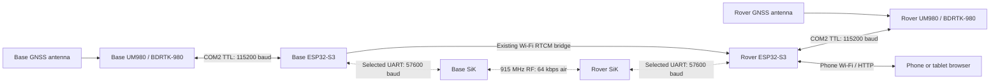

# Radio and electronics architecture

Updated 2026-09-12. This document consolidates selected wiring and current implementation status. It applies to the original Waveshare **ESP32-S3-Touch-LCD-3.5**, not the 3.5B. Physical connector orientation must match the particular boards.

## Signal paths and status



Dashed connections are the selected SiK instrument integration. The ESP32 standalone synthetic diagnostic is implemented; the production RTCM bridge is **not implemented/qualified**. Earlier radio PC USB tests found losses/corruption. On 2026-09-12 both ESP32s were connected to radio TTL interfaces, with UM980s disconnected; After correcting reversed TX/RX wiring, both local UART identity probes and a 117-packet-per-direction SiK test passed. This is close-bench evidence only; range and production RTCM remain pending. Current saved radio serial speed is 57600 after the comparison test, with no demonstrated cure. The existing COM2/Wi-Fi path previously produced RTK FIXED; that does not qualify the newly reported faulty carrier or establish survey accuracy.

The UM980 generates/consumes RTCM and computes GNSS solutions. The ESP32 hosts display, survey storage/UI and transport handling; it does not compute satellite RTK solutions. The future radio UART bridge will carry RTCM plus explicitly framed, bounded status/control messages. Base-to-Rover corrections do not require Rover feedback; bidirectional status/control does. An ESP32 reboot interrupts this proposed correction path.

Base and Rover are selectable roles, not fixed identities for Unit A/B. The healthy UM980 is recommended as Base and suspect COM1 carrier as a temporary COM2-only Rover. That recommendation is not evidence that the physical assignment was applied. The SiK USB identities likewise have not been mapped to instrument letters. See the [fault note](hardware/unicore-um980/temporary-com1-fault-plan.md).

## Per-instrument UART wiring

| ESP32 GPIO / direction | Waveshare J8 physical pin | Other device signal | Baud/status |
|---|---:|---|---|
| GPIO43 / TX | 25 | BDRTK `TTL_RXD2` | UM980 COM2, 115200; existing bidirectional GNSS link |
| GPIO44 / RX | 27 | BDRTK `TTL_TXD2` | UM980 COM2, 115200; existing bidirectional GNSS link |
| GPIO17 / TX | 16 | SiK TTL `RX` | UART2 diagnostic, 57600; crossed wiring bench-verified |
| GPIO18 / RX | 18 | SiK TTL `TX` | UART2 diagnostic, 57600; crossed wiring bench-verified |
| GND | 29 or 30 | BDRTK GND and SiK signal GND | Common signal reference |

Signals are crossed: each device's TX goes to the other's RX. Current firmware uses hardware UART1 for GNSS; hardware UART2 implements the selected diagnostic radio mapping. Do not use `Serial` USB debugging as the radio UART. GPIO17/18 share only the unused camera function in this allocation; the owner confirmed no camera is installed or planned.

Use **3.3 V TTL** signals, never the BDRTK RS232 outputs on ESP32 pins. Leave faulty COM1 disconnected in this architecture. The BDRTK USB/CH340 interface is COM3, separately from COM2. Initial SiK wiring has no RTS/CTS; its saved hardware-flow-control setting is 0. Radio connector numeric pin positions and cable colours are deliberately not assigned here: confirm the 1 W six-pin connector drawing/orientation and continuity before crimping. It is not interchangeable with the BDRTK five/eight-pin connectors.

Sources: [archived Waveshare schematic](hardware/waveshare-esp32-s3-touch-lcd-3.5/references/board-schematic.pdf), [Waveshare allocation](hardware/waveshare-esp32-s3-touch-lcd-3.5/README.md), [verified COM2 integration](hardware/unicore-um980/esp32-uart-integration.md), [Holybro connector drawings](https://docs.holybro.com/radio/sik-telemetry-radio-v3/dimension-and-pinout).

## Power and related connections

```text
Per instrument: protected 3S battery -> fuse / main switch
  +-> separate battery branch -> SiK XT30 (specified 7-28 V input)
  +-> 5 V buck converter
       +-> Waveshare regulated 5 V / USB-VBUS input, with source isolation
       +-> BDRTK 5V_IN (carrier; not the bare UM980 module supply)
       +-> appropriate regulated supply for future BNO085 breakout
Common ground between the branches and all TTL devices.
```

The selected 1 W radio is not powered from the ESP32 3V3 pin or its 5 V rail. Its external antenna remains connected whenever powered, or is replaced with a correctly matched RF test load as discussed below. Keep the GNSS antenna on the GNSS receiver's antenna connector; it is a separate RF system from SiK and ESP32 Wi-Fi/BLE.

Waveshare J8 pin 2 is **USB VBUS**, not a generated 5 V output; do not tie independently powered USB VBUS/5 V sources together. The USB-isolation/power-path design is still pending. J8 BAT is the board's single-cell PMU rail, **not a 3S input**. Keep radios/GNSS on their documented supply branches; see [power architecture](power.md) for fuse, BMS, regulator and back-feed constraints. The radio's USB and XT30 behavior should be verified against the exact revision before assuming a universal power arrangement.

| Other function | GPIO / interface | Status or restriction |
|---|---|---|
| LCD | SPI GPIO1/2/3/5; backlight GPIO6 | Existing |
| Touch, RTC, onboard IMU/PMU, expanders | I2C GPIO7 SCL / GPIO8 SDA | Existing shared bus; J8 pins 26/28 |
| microSD | GPIO9 D0 / GPIO10 CMD / GPIO11 CLK | Existing 1-bit SD_MMC |
| Native USB | GPIO19 D- / GPIO20 D+ | Preserve for flashing/debug |
| BNO085 | Potential shared I2C 7/8 | Address/pull-ups/supply and extra control pins unqualified; no tilt compensation claimed |
| BLE | ESP32-S3 internal radio, shared with Wi-Fi | Future; BLE only, not Classic Bluetooth SPP |
| SiK reset/power gating | None assigned | No ESP32-controlled supply switch is implemented |

[Espressif Bluetooth support matrix](https://docs.espressif.com/projects/esp-idf/en/latest/esp32s3/api-guides/bt-architecture/overview.html).

## Radio power control and antenna handling

Reducing TXPOWER does **not** establish safe antenna-free operation. The current value 1 on Holybro's 1 W variant still corresponds to approximately **12.5 mW**, not RF off. No manufacturer guarantee of a safe open-connector power level was found in the reviewed specifications. Treat antenna/load connection before power as the project rule. If a non-radiating bench setup is needed, use a correctly matched 50-ohm RF dummy load with the right connector and a rating covering 915 MHz and the radio's maximum possible output (at least 1 W); RF coupling/attenuation design is a separate test setup. Do not directly join two powered RF outputs with a cable.

The ESP32 can eventually control the radio through the same UART AT interface: pause correction output, observe the command-mode guard times, read/validate settings, set a supported TXPOWER, verify acknowledgement/readback and leave command mode. `AT&W` is only needed when deliberately persisting the setting; do not repeatedly write flash during routine monitoring. The reviewed SiK command set applies power changes immediately, whereas most other changes require restart. The endpoint must explicitly report an interruption/unready state while commands run. Power-setting control remains a design recommendation. The implemented diagnostic can temporarily enter command mode to read local identity with ATI and return with ATO.

Software commands after startup do not guarantee RF is off before boot or during reset/failure. A true power-off function needs a suitably rated hardware supply switch/interlock, which is not present. Radio synchronization traffic can occur even with no RTCM input. Sources: [Holybro power mapping](https://docs.holybro.com/radio/sik-telemetry-radio-v3/rf-transmission-power-setting-for-1w-variants), [SiK commands and TDM behavior](https://ardupilot.org/copter/docs/common-3dr-radio-advanced-configuration-and-technical-information.html).

## Error handling and next acceptance

The USB failures are significant enough to block link acceptance, but do not prove damaged radio hardware or implicate the separate faulty UM980 COM1. A wireless link cannot be designed around a promise of zero RF errors. It needs prevention where practical, detection, explicit loss handling and validated recovery.

- The current Wi-Fi RTCM receiver checks wrapper length/checksum and RTCM CRC24Q before forwarding to UM980 COM2. Invalid input is rejected. CRC detects corruption; it does not reconstruct arbitrary missing bytes and is not authentication.
- Current survey gating uses the greater of valid-correction arrival age and receiver-reported differential age, alongside other prerequisites. This is not independent decoding of every RTCM observation epoch. The SiK path needs the same integrity/readiness handling plus explicit framing, bounded buffering, source/session identity, gap tracking and stale/duplicate rejection.
- Radio FEC can correct limited bit errors at a bandwidth cost when supported, but cannot fix every lost packet or a later UART/USB error. It remains disabled in the saved diagnostic profile; the current SiK documentation cautions against enabling it indiscriminately.
- Retries are appropriate for acknowledged configuration commands with request IDs and idempotency. For live RTCM, use age-limited queues/retries if justified, favour current corrections and drop expired data. Replaying old corrections indefinitely is not a repair strategy.
- Once an observation was collected without adequate corrections, one cannot promise to repair its survey coordinate later. PPK requires separately recorded suitable raw observations, timing and reference data; those capabilities are not established here.

Use the [reusable field test](transport-field-test.md) to isolate USB/TTL, RF, Wi-Fi and later BLE. Passing synthetic bytes is only the first stage: actual RTCM rate/message integrity, correction gaps, RTK recovery and independent check-point agreement must follow.
