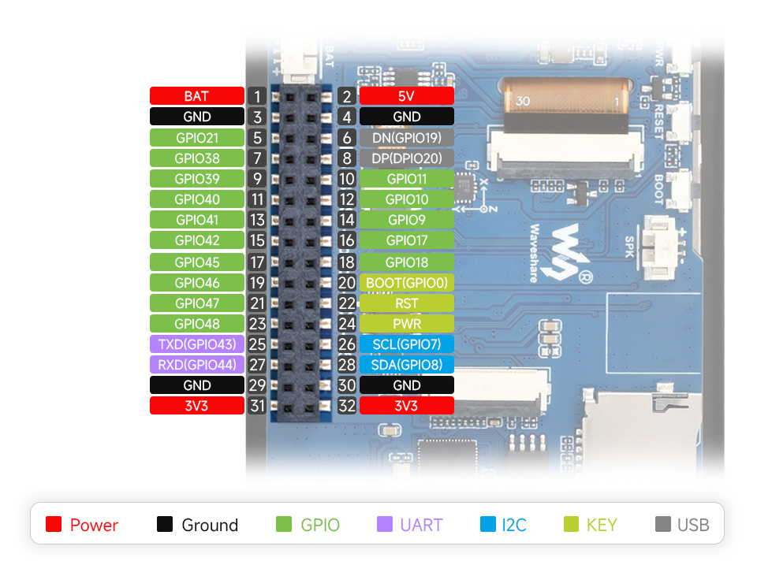
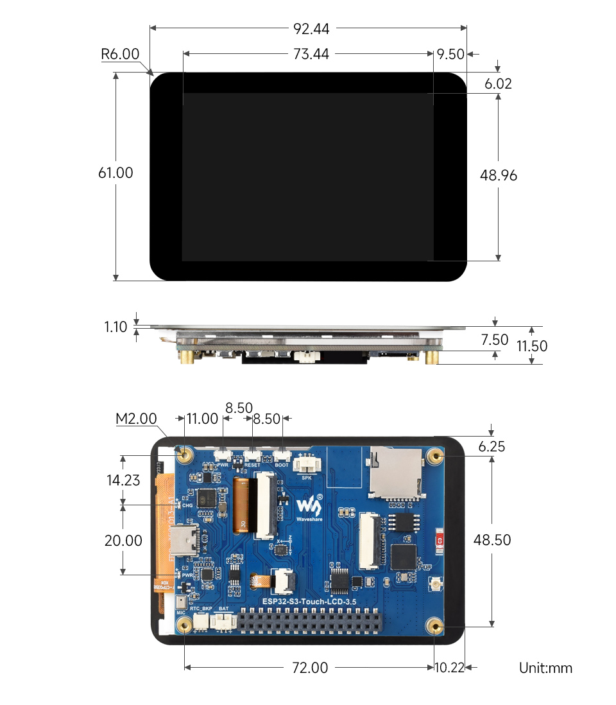

# Waveshare ESP32-S3-Touch-LCD-3.5

> Applies to the original **ESP32-S3-Touch-LCD-3.5**, not the later `3.5B` model. Reconfirm the printed product name and PCB revision before relying on this pin map.

## Quick Links

- [Local schematic](references/board-schematic.pdf)
- [Local 2D/3D project files](references/board-2d-3d.zip)
- [Local component datasheets](references/datasheets/)
- [Source URLs and checksums](SOURCES.md)
- [Demo firmware](../../../firmware/waveshare-board-demo/README.md)
- [First test record](../../../tests/2026-09-04-waveshare-display-touch/README.md)

## Pinout and Dimensions

The images below are stored in this repository, so the documentation remains usable if the manufacturer page changes.

[Open the local full-resolution pinout](assets/pinout.jpg)

[Open the local full-resolution dimensions drawing](assets/dimensions.jpg)

### 32-pin expansion header

The table follows the numbering printed in Waveshare's pinout. Always verify the physical pin-1 marker before connecting hardware.

| Pin | Signal | Pin | Signal |
|---:|---|---:|---|
| 1 | `BAT` | 2 | `5V` |
| 3 | `GND` | 4 | `GND` |
| 5 | `GPIO21` | 6 | USB `DN / GPIO19` |
| 7 | `GPIO38` | 8 | USB `DP / GPIO20` |
| 9 | `GPIO39` | 10 | `GPIO11` |
| 11 | `GPIO40` | 12 | `GPIO10` |
| 13 | `GPIO41` | 14 | `GPIO9` |
| 15 | `GPIO42` | 16 | `GPIO17` |
| 17 | `GPIO45` | 18 | `GPIO18` |
| 19 | `GPIO46` | 20 | `BOOT / GPIO0` |
| 21 | `GPIO47` | 22 | `RST` |
| 23 | `GPIO48` | 24 | `PWR` |
| 25 | `TXD / GPIO43` | 26 | `SCL / GPIO7` |
| 27 | `RXD / GPIO44` | 28 | `SDA / GPIO8` |
| 29 | `GND` | 30 | `GND` |
| 31 | `3V3` | 32 | `3V3` |

### Header cautions

- `BAT` is the single-cell battery rail associated with the onboard AXP2101. It is **not** an input for a 2S or 3S battery.
- `5V`, `3V3`, and `BAT` are separate power domains. Do not connect them together or back-power them without validating the schematic and intended supply path.
- GPIO19/20 are native USB D-/D+. Using them as ordinary GPIO interferes with USB.
- GPIO0 is the BOOT strapping pin. GPIO45 and GPIO46 are also ESP32-S3 strapping pins; external circuits must not force invalid reset levels.
- GPIO7/8 are the shared onboard I2C bus. External devices require a non-conflicting address and compatible pull-ups and logic voltage.
- Many exposed GPIOs also serve onboard functions. Treat them as available only after disabling and validating the conflicting function.

## Relevant Hardware

| Function | Device/interface | Mapping |
|---|---|---|
| MCU | ESP32-S3R8 | Dual core, 240 MHz, 8 MB embedded PSRAM |
| Flash | W25Q128 | 16 MB |
| Display | ST7796 over SPI | MOSI GPIO1, MISO GPIO2, DC GPIO3, SCLK GPIO5, no CS |
| Backlight | GPIO output | GPIO6, active high |
| Shared I2C | ESP32-S3 I2C | SDA GPIO8, SCL GPIO7 |
| LCD reset | TCA9554 at `0x20` | Expander pin 1 |
| Touch | FT6336/FT6X36 on I2C | Address `0x38` |
| Onboard IMU | QMI8658 | Pending test |
| RTC | PCF85063 | Pending test |
| Power management | AXP2101 | Pending test |
| Storage | microSD/TF | Pending test |

## Onboard Port Allocation

This allocation comes from the archived schematic and the official Arduino examples.

| Function | GPIOs/bus | Notes |
|---|---|---|
| LCD SPI | 1 MOSI, 2 MISO, 3 DC, 5 SCLK | No separate GPIO chip-select in the official example |
| LCD backlight | 6 | Active high in the official example |
| LCD reset | TCA9554 pin 1 | I/O expander is at I2C address `0x20` |
| Shared I2C | 7 SCL, 8 SDA | Touch, TCA9554, QMI8658, PCF85063, AXP2101, and ES8311 |
| Touch | Shared I2C, address `0x38` | FT6336/FT6X36 family |
| microSD, 1-bit SD_MMC | 9 D0, 10 CMD, 11 CLK | Official Arduino example mapping |
| Audio I2S | 12 MCLK, 13 BCLK, 14 DIN, 15 LRCLK, 16 DOUT | ES8311 audio path |
| Camera control | Shared I2C 7/8 | Camera SCCB/TWI control bus |
| Camera signals | 17, 18, 21, 38-42, 45-48 | Conflict with expansion use even though exposed |
| Native USB | 19 D-, 20 D+ | Also exposed as GPIO19/20 |
| Exposed UART | 43 TXD, 44 RXD | Initial candidate for one external 3.3 V TTL serial device |
| BOOT button | 0 | Active-low/strapping behavior; use cautiously as an application button |

### TopoRTK connection guidance

- Reserve GPIO43/44 as the first external UART candidate. Verify the UM980 carrier's TTL voltage; never connect true RS-232 levels directly.
- GPIO7/8 may host the BNO085 only after checking addresses, pull-ups, cable length, and noise on the existing I2C bus.
- Without a camera, some camera GPIOs may be reassigned, but release each deliberately in firmware and check boot-strapping and board connections.
- Do not finalize GNSS/radio pins from the header image alone. Check the local schematic and validate one interface at a time.

## Archived Component Datasheets

| Component | Function | Local copy |
|---|---|---|
| ESP32-S3R8 | MCU, Wi-Fi, BLE, and embedded PSRAM | [Datasheet](references/datasheets/esp32-s3-datasheet.pdf) |
| ST7796S | 320 x 480 LCD controller | [Datasheet](references/datasheets/st7796s-datasheet.pdf) |
| FT6336U | Capacitive-touch controller | [Datasheet](references/datasheets/ft6336u-datasheet.pdf) |
| QMI8658C | Onboard 6-axis IMU | [Datasheet](references/datasheets/qmi8658c-datasheet.pdf) |
| PCF85063A | Real-time clock | [Datasheet](references/datasheets/pcf85063a-datasheet.pdf) |
| AXP2101 | Single-cell power-management IC | [Datasheet](references/datasheets/axp2101-datasheet.pdf) |
| ES8311 | Audio codec | [Datasheet](references/datasheets/es8311-datasheet.pdf) and [user guide](references/datasheets/es8311-user-guide.pdf) |

Upstream links remain in [SOURCES.md](SOURCES.md) so newer revisions can be found and archived copies can be audited.

## Connected-Board Identification

Recorded on 2026-09-04 before the first project flash:

| Item | Observed value |
|---|---|
| Windows port | `COM4` |
| USB interface | Espressif USB Serial/JTAG |
| USB ID | `303A:1001` |
| Chip | ESP32-S3 QFN56, revision 0.2 |
| PSRAM reported by ROM tool | 8 MB embedded PSRAM |
| Crystal | 40 MHz |
| USB mode | USB-Serial/JTAG |

The serial port is machine-specific and may change after reconnecting the board.

## First Validated Checkpoint

On 2026-09-04, the project demo was built and flashed to the connected board. USB serial remained stable for more than one minute, and the project owner confirmed the display, colors, touch markers, and coordinate updates. See the [test record](../../../tests/2026-09-04-waveshare-display-touch/README.md).

