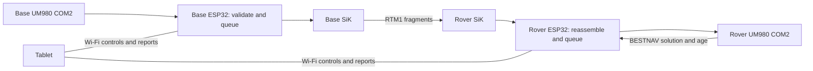

# Live SiK correction bridge

**2026-09-14 bench validation (0.11.5):** the production SiK path was validated end-to-end with real receivers at bench range — Base UM980 COM2 RTCM (~4 frames/s full profile) over RTM1 envelopes to the Rover, ~94% delivered, every delivered frame forwarded into the Rover UM980, zero output faults; paired synthetic radio test passed 15/15 both directions with zero loss. Indoors: no GNSS fix, so RTK FIXED, recovery-under-sky and range remain outdoor work. Peer "Update overdue" indoors is the Rover quality gate, by design. See [bench evidence](../tests/2026-09-14-sik-bench/README.md).

This increment connects the existing Base COM2 RTCM parser to the validated RTM1 transport core, then connects the Rover reassembler to a bounded COM2 output queue. Packet-loss investigation remains [deferred](packet-loss-investigation.md). A perfect synthetic delivery score is not a prerequisite for receiver testing.

The portable bridge, production COM2 writer and browser controls have automated coverage. Both builds and flash verification passed. ~~Real UM980 correction flow~~ (validated at bench range 2026-09-14, above), receiver differential age under sky, RTK recovery and independent field accuracy checks are still required. See the [dated evidence](../tests/2026-09-13-correction-bridge/README.md).

## Connections

Use the known-good UM980 as Base and the COM1-faulty UM980 as temporary Rover. The faulty board's COM1 stays disconnected; this path uses COM2 in both directions.

| Each ESP32 | Other end | UART settings |
|---|---|---|
| GPIO43 TX, J8 pin 25 | UM980 `TTL_RXD2` | UART1, 115200, 8N1 |
| GPIO44 RX, J8 pin 27 | UM980 `TTL_TXD2` | Same COM2 link |
| GPIO17 TX, J8 pin 16 | SiK radio RX | UART2, 57600, 8N1 |
| GPIO18 RX, J8 pin 18 | SiK radio TX | Same radio link |
| GND | UM980 and radio GND | Common signal ground |

Keep the existing independent power arrangements and antennas attached. Follow the [power/interconnection plan](hardware/unicore-um980/esp32-uart-integration.md); when both boards have USB power, leave their 5 V interconnection absent. Neither SiK connects directly to UM980 COM1 in this architecture. Both ESP32s must run compatible RTM1 firmware; the radio stream is framed, not raw RTCM. No radio baud, air rate, power, ECC or antenna setting changed in this increment.



The PC is only needed for development/flashing. Neither a PC nor tablet relays correction data. The tablet can disconnect after selecting the session.

## Select the correction route

1. Normal selection is a single pair-wide request from the **Settings** page (`/settings`) or its API; the per-instrument local control below is the **recovery** path for a pair that cannot confirm itself, not the everyday way to switch. The local form is **Radio** or **Wi-Fi** under **Live correction routing** on `/diagnostics` (the API form is `{"op":"corrections","transport":"sik"|"wifi","confirm":true}`; there is no session field). The choice is stored on that instrument and restored at boot; Wi-Fi remains the default until a medium is selected.
2. Nothing is copied between instruments. The logical Base mints a fresh session during current-boot negotiation on the selected medium and the Rover follows automatically; both then report **connected** with the same internal session. Negotiation is capped at 20 seconds, and an unreachable peer keeps reporting its own state instead of a success.
3. Both instruments must select the same medium. A mismatch simply never pairs: each instrument reports its own state and keeps production output inhibited. Selecting one medium never forwards the other medium's corrections.
4. Before a CRC-valid 1005/1006 base reference arrives, they show **Waiting for a base reference**. With the current receiver profile the reference repeats every ten seconds. The Rover drops observations until it has a reference for the selected station.

Requests are asynchronous. Check the displayed route/error after submitting. The survey admission gate can reject a request during an occupation, receiver operation, queued job write or brief service contention; finish the operation or retry when idle. Repeating the already-selected medium is a no-op. Changing the medium ends the old session and negotiates a fresh one, so no old session identity or replay window is reused.

**Pair-wide selection (0.11.17-arch-r6 and later):** `GET /api/v1/settings` reports the durable selection revision, the selected and candidate medium, peer connectivity and the current operation; `POST /api/v1/settings` with `{"id":"<32 hex>","revision":N,"op":"link.select","transport":"sik"|"wifi","confirm":true}` asks the **pair** to switch, coordinated by the Rover unit and admitted once at a time with the same survey/receiver/OTA exclusions. The request returns 202 and its outcome (including restoration of the previous medium after a failed cutover) is published in the same endpoint, so a queued request is never reported as "connected". This is the API the Settings page will consume; until that page ships, the per-instrument selection above remains the operator workflow and both instruments must still be set to the same medium.

**Restart behavior:** the stored medium is restored at boot and a fresh current-boot session is negotiated automatically — no rejoin step and no session number to reuse. Replay high-water marks survive an ordinary outage of the same proven boot; a proven boot change starts a new session with cleared replay/queue/health state. Role changes end the live selection. Radio/output faults inhibit forwarding rather than silently switching an active session to Wi-Fi; reselecting the medium clears the fault. Receiver outages retain the selected radio session and recover with new valid messages, a base reference and receiver-confirmed quality.

The SiK route excludes Wi-Fi correction input/output. Wi-Fi continues to serve the tablet and networking diagnostics. Pairing proves current-boot bidirectional reachability, not per-frame delivery: Base transmission counts still do not prove Rover reception. SiK RSSI is unavailable here; the Rover status API does not substitute Wi-Fi RSSI or Wi-Fi peer age for it.

## Bounded forwarding policy

- `correction::Bridge` uses a fixed workspace: 10,792 bytes on ESP32, 10,800 on the native host. It accepts explicitly selected production sessions above 999999, separate from the six-digit synthetic-test session range. RTM1 source must be Base (`0`). Wire input cannot select a session. CRC/session/sequence checks are not authentication.
- Each burst queue has eight whole-frame slots, at most 1029 bytes each: one reserved for reference 1005/1006, one for descriptor 1033 and six for observations. These are 8,340 bytes per queue. The live radio queue and COM2 queue are separate fixed allocations.
- Reference traffic receives priority, with at most two consecutive metadata dequeues when observations are waiting. Observation overflow evicts the oldest queued observation, never a reserved reference slot. Newer queued epochs replace older queued frames of the same MSM type/station; same-epoch pieces are retained. GLONASS epoch replacement is conservatively disabled because its day/time encoding differs. The already-transmitting frame finishes or expires before the next frame starts.
- Queues expire entries at 1500 ms. Radio reassembly retains the existing 1000 ms assembly and 1500 ms known-age limits. Sender queue age is carried through reassembly into the COM2 queue rather than reset at each handoff. Empty/expired queues recover on new input without restarting the instruments.
- Rover admits a whole frame only when its 2048-byte GNSS TX buffer has room. One whole frame is admitted per main-loop service call; it never deliberately sends a prefix and retries the suffix. Profile changes, receiver loss and route resets clear queued output and readiness history. Corrupt/incomplete frames never enter this queue. The firmware latches any surfaced short-admission failure instead of retrying it.
- Radio RX work is capped at 2048 bytes per loop and radio TX at one 256-byte envelope. Existing diagnostics remain the sole owner of `HardwareSerial(2)`; they dispatch to either live forwarding or a diagnostic, never both. The radio RX/TX buffers remain 4096/1024 bytes.

These are whole-message queues, **not atomic multi-message MSM epochs**. A missing fragment can discard one constellation message while others continue; receiver quality and collection gates determine usability. The parser checks framing/CRC, supported message headers and station, not every satellite/cell semantic field. Reference 1005/1006 is required before observations; 1033 alone cannot choose a station. Station changes require a local reset/new selection.

## Freshness and observability limits

The readiness observer ignores metadata and repeated/older MSM epochs. It combines observation arrival age with the receiver's BESTNAV differential age advanced by time since that report, requires a fresh valid receiver report and matching station, and retains the existing survey/fix/reference/accuracy rules. The missing-receiver bench must remain **waiting for observations**, with readiness false and no survey points collected.

Known transport age does **not** include unobserved time in SiK/modem buffers before the first fragment arrives. This increment does not establish an absolute GNSS epoch-age bound or a maximum end-to-end RF latency. A delayed but CRC-valid frame may reach the receiver; receiver differential age/quality must gate collection. Validate those gates with live receivers before field use.

`corrections` in `GET /api/v1/diagnostic` reports the selected route/session/station, queued and transmitted counts, reassembly errors/expiry, replay/session rejection and COM2 queue counters. Queue expiry/overflow counters accumulate over the boot even when a route is reselected; session traffic counters reset on selection. `output.forwarded` counts complete frames admitted to the UART API, not acknowledgement from UM980. The pinned Arduino `HardwareSerial::write` returns the requested length after calling its driver, so its short-write counter cannot establish successful physical transmission. BESTNAV and real receiver checks remain necessary. Live counters are not yet a persistent run report; existing finite radio diagnostics retain their downloadable reports.

The control API is the existing authenticated, same-origin-checked `POST /api/v1/diagnostic`:

```json
{"op":"corrections","transport":"sik","session":0,"confirm":true}
```

Both instruments sample the same negotiated session id while paired. The Base mints it during negotiation and the Rover confirms it; the displayed integer is diagnostic information, not something an operator enters. `{"op":"corrections","transport":"wifi","confirm":true}` selects Wi-Fi. A 202 means queued, not applied; read `corrections` for the result. Latest takeover still wins, without a PIN.

## Next receiver check

Reconnect the healthy Base and temporary COM2-only Rover using the wiring above. Verify identity, command replies and saved role/profile before selecting SiK. Confirm real 1006/1033 and MSM delivery, matching station, actual differential age and RTK fixed under clear sky. Introduce a finite correction outage; collection must inhibit on stale data and recover only on fresh observations and a fresh receiver solution. Check reference recovery after dropped metadata. Record actual load, queue pressure, correction ages and receiver recovery. Independent field check points and replacement-board validation remain separate acceptance work. Reliable acknowledged commands/status follow this receiver integration; RF root-cause investigation stays deferred unless loss prevents useful operation.


## Outdoor handoff and allowance pause

Operator confirmed both GNSS antennas are connected but indoors without sky view. Moving outdoors requires unplugging PC USB. Do not interpret the current zero-satellite state as a radio fault. The five-hour allowance reached 91% used / 9% remaining; implementation and new tests paused, with documentation and repository backup completed at this checkpoint.

After the USB upload is finished, power each complete instrument using its established supplies: ESP32, UM980 and radio must all remain powered, with their common grounds and antennas connected. Disconnect the PC and move the antennas into open sky, keeping Base stationary. The stored medium survives a power interruption, so a previously selected Radio route comes back automatically.

On the tablet, open either instrument's `/diagnostics` and take control; both instruments show their own local selection and pairing state, and a selection applies only to the instrument you are connected to, so choose **Radio** on each. No session number is displayed, copied or entered. Switching tablet networks between instruments is fine; the SiK data path does not require simultaneous browser connections or any Base Wi-Fi reachability. In local-router mode the tablet must be able to reach that router; the Rover also exposes the Phone/Tablet access point.

Wait for GNSS acquisition and Base's temporary survey/profile to produce a reference and observations. Record Base submitted/envelope counts, Rover completed/output/expiry/error counts, station and receiver differential age/fix. Do not collect a point during the first recovery check. After establishing useful corrections, interrupt only the correction path for a finite interval while leaving both receivers powered, then restore it. Stale corrections must inhibit readiness and fresh observations plus receiver-confirmed quality must restore it. Do not disconnect radio antennas to create the outage. Coordinate this deliberate interruption in the next test session; no test was armed before moving.

Live counters are RAM snapshots, not a saved autonomous test report. Keep/download the available diagnostic JSON while the instrument remains powered; persistent autonomous live-recovery reporting remains future work. The existing synthetic diagnostic reports are preserved separately and are not proof of this live receiver test.
