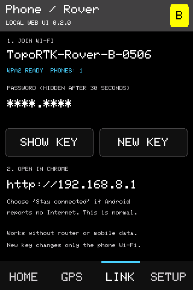

# Rover phone/tablet Wi-Fi

Status: **Implementation, native checks and two-unit transport check passed. Initial Android connection reported working by the user. Extended mobile/recovery coverage remains open.**

## Configuration

Unit A / COM4 is Rover and was flashed with UI 0.2.0. Unit B / COM10 remains Base on its previous firmware; the new source also builds for Unit B. Both retain Night brightness, enabled RTCM and VERIFIED receiver profiles. The transport test restores Local Router afterward.

Unit A advertises `TopoRTK-Rover-A-16C8`, normally at `http://192.168.8.1`. Its router address is `http://192.168.100.20`. The phone AP adds an independent /24 network alongside the correction station; it does not provide Internet routing. A station-subnet conflict selects the alternate AP address `172.22.42.1`.

The user requested an eight-digit numeric password with a middle period (`dddd.dddd`). The final upload migrates the initial 16-character key once and saves the replacement in NVS. Actual keys are deliberately excluded from this record, API, logs and screenshots. View the current key on **Link → Phone / Tablet → Show key** and update the saved phone Wi-Fi connection after migration.

Final Unit A binary: 946,704 bytes; SHA-256 `7b75c1730a3bce0282eaad1830103632f640d0f96c413a6aab9c4a9f83e83267`. Upload hash verification passed.

## Evidence

- Both hardware variants build successfully; Unit A upload passed.
- Native tests execute the actual AP module and firmware against hardware doubles: numeric format, one-time legacy migration, saved-key reuse without another write, rejected corrupt storage, failed replacement retaining the current AP/key, confirmation timeout/cancellation, 30-second hiding, subnet separation and conflict fallback. Key replacement leaves receiver commands, runtime configuration and the station connection unchanged. Status/log output contains no key.
- Actual touchscreen rendering passes bounds/caching assertions. The connection page below is a host rendering with a masked test key, not a photograph of the device.
- [Transport results](transport-results.json) show Direct Link working with the Rover phone AP ready: Base sent 55 peer packets during the test, Rover reported increasing receive counters with `gap=0 bad=0`. Both profiles stayed VERIFIED. Local Router and the status endpoint recovered afterward, with no receiver commands/profile reapplication caused by transport changes.
- The user had a phone and tablet available and reported “It worked” after receiving connection instructions. Models, Android/Chrome versions, which devices were used and the complete disconnect/recovery sequence were not separately recorded; do not infer that the full matrix passed.
- A subsequent repeated-HTTP test was interrupted when Unit A disappeared from USB and the router network. The live browser rerun also could not reach it. Those interrupted attempts are not recorded as passing. The earlier status checkpoint's stress-test result remains historical evidence for that firmware, not a substitute for this build's extended mobile/load test.
- [Controlled browser tests](browser-results.json) pass at 320/390/768/1200 pixels, including stale/frozen data, malformed JSON, disconnect clearing, and automatic/manual recovery. These ran against simulated snapshots after the hardware became unavailable; `liveUrl` is explicitly `null`.



## Reproduce

From `firmware/um980-display-demo`:

```powershell
pio run -e unit_a -e unit_b
python test/run_host_tests.py
python test/check_phone_transport.py
$env:TOPORTK_TEST_RECORD='tests/2026-09-10-rover-phone-wifi'
python test/check_web_hardware.py http://192.168.100.20 COM4 COM10
node test/check_web_browser.cjs http://192.168.100.20
```

Hardware scripts require pyserial and exclusive access to COM4/COM10. The transport script temporarily switches both units to Direct Link and restores Local Router; run only with the documented role assignment and a bench where transport changes are expected. Browser tests require Playwright/Edge and native JSON fixtures; set `NODE_PATH` if using the bundled runtime. Without a URL the browser script exercises controlled snapshots only and does not claim live hardware validation.

## Remaining field checks

Record actual phone/tablet model, Android and Chrome version; WPA2 join; explicit no-Internet acceptance; simultaneous readers; browser close/reopen; phone Wi-Fi off/on; instrument power cycle with the same saved key; confirmed key replacement and reconnection; router/Base loss while phone access remains useful. Repeat the test under live RTCM traffic and open-sky GNSS. This bench had no usable fix or correction stream, so it establishes peer-link coexistence, not full RTK throughput or measurement accuracy.

The prioritized next implementation work is in the [survey web/app roadmap](../../docs/web-app-roadmap.md).
