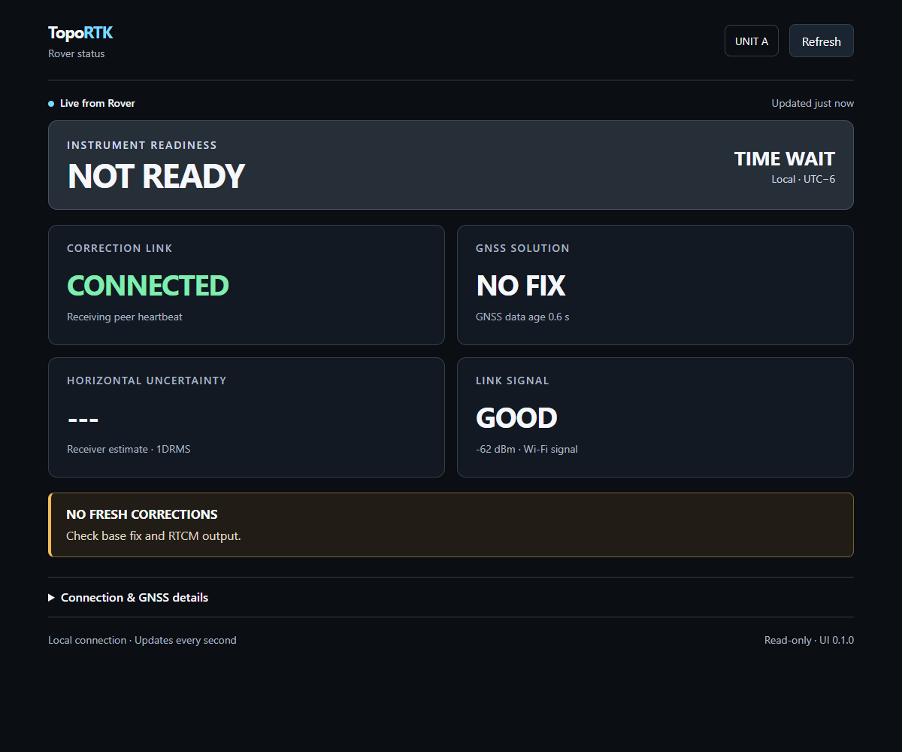
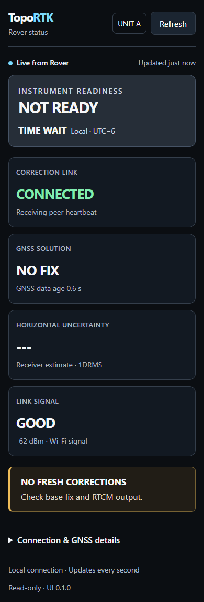
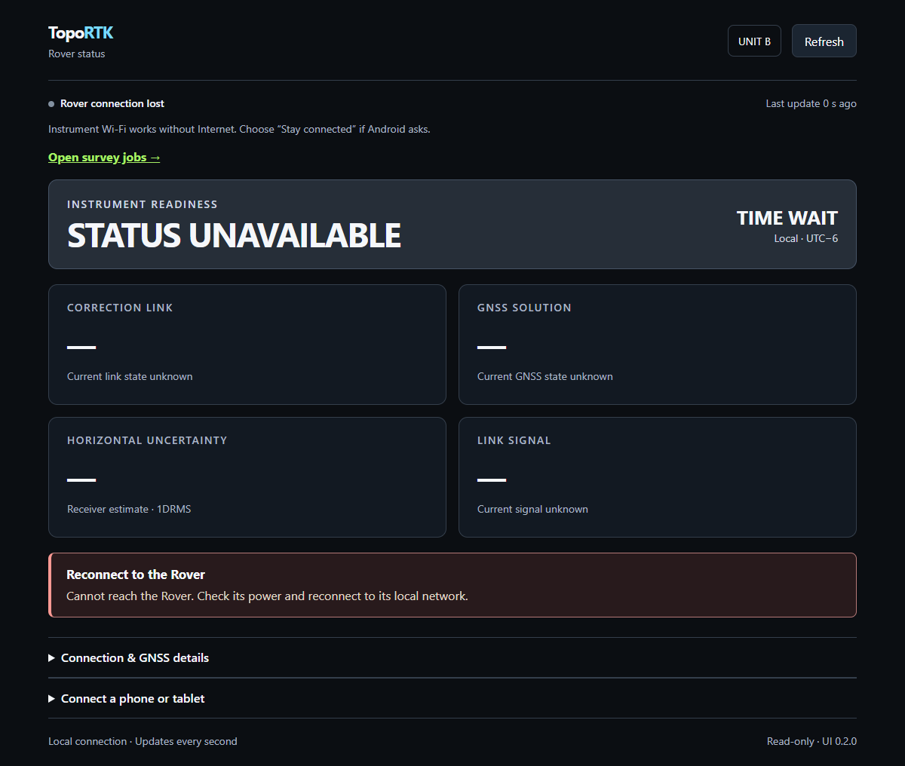

# Read-only Rover browser status

**Result: PASS — PC/local-router checkpoint.** UI 0.1.0 and API v1 are implemented and uploaded to Unit A. Physical Android testing and the standalone Rover access point remain the next checkpoint.

## Setup and scope

- Unit A / COM4: saved Rover, Night brightness, RTCM enabled, Local Router; receiver profile VERIFIED. HTTP address `http://192.168.100.20`.
- Unit B / COM10: saved Base, Night brightness, RTCM enabled, Local Router; receiver profile VERIFIED. Existing Base firmware retained. The new firmware also builds for Unit B.
- ESP32-S3, PlatformIO espressif32 7.0.1, Arduino ESP32 2.0.17. No additional library or SD asset installation.
- Final Unit A firmware binary SHA-256: `3c3d93c6b119ade7bd83cb7a4b756184ba4060b21faf2c69d77d0aa8426f4d64` (940,496 bytes). Upload hash verification passed.
- Indoor bench with no usable GNSS fix, GNSS time or live RTCM corrections. No reference coordinates or antenna accuracy measurements apply. Healthy peer heartbeats are the live transport evidence; this is not an RTK-throughput or field-accuracy test.
- Router credentials remain in the ignored local header. Test artifacts exclude credentials, coordinates and raw receiver identifiers.

## Checks and evidence

| Check | Result |
|---|---|
| Production firmware builds, both unit variants | PASS |
| Unit A upload and automatic saved Rover profile | PASS; VERIFIED and reachable on router |
| Production status formatter, current/stale GNSS, bounded JSON, invalid accuracy | PASS; native test runs actual firmware logic with hardware doubles |
| Status generation leaves NVS, active config and receiver output unchanged | PASS; native assertions |
| Root and versioned page, no-cache responses | PASS; `/` and `/ui/v1/` return identical HTML |
| 30 page GETs with full status snapshots over about 40 seconds | PASS; every sample uptime advanced, same boot ID, peer packets 513 → 673, gaps/errors remained 0 |
| Slow incomplete HTTP request | PASS; timeout recovery with continuing uptime and peer traffic |
| POST/PUT status and DELETE root | PASS; HTTP 405, `Allow: GET`, `read_only` |
| Unknown GET `/api/v1/config` | PASS; HTTP 404 |
| Serial config before/after HTTP exercise | PASS; both configs identical, no receiver commands or profile reapplication observed |
| Isolated headless Microsoft Edge 152.0.4191.66 | PASS; real page, advancing packet counter and three browser reloads |
| Desktop responsive widths 320, 390, 768, 1200 pixels | PASS; no horizontal overflow, connection label stays on one line |
| Controlled stale GNSS, failed fetch, frozen snapshot, malformed JSON | PASS; readiness clears and stale values are removed; automatic/manual recovery returns to current state |
| Client request and JavaScript checks | PASS; local GET requests only, no page errors |

[Hardware results](hardware-results.json) contain the before/after snapshots and sanitized serial output. [Browser results](browser-results.json) identify the browser and checks. HTTP bench results were captured before the final mobile layout/error-message polish; the final UI was rebuilt, reflashed and browser-tested again.

Visual inspection found a split `CONNECTED` label in the initial narrow two-column layout. The final UI uses single-column cards below 440 pixels. The final desktop and phone-width screenshots below are from the actual Rover. The disconnect screenshot uses a controlled browser fixture and is labeled accordingly.







## Reproduce

Run from `firmware/um980-display-demo`:

```powershell
pio run -e unit_a -e unit_b
python test/run_host_tests.py
pio run -e unit_a -t upload
python test/check_web_hardware.py http://192.168.100.20 COM4 COM10
node test/check_web_browser.cjs http://192.168.100.20
```

Native checks require g++ and Python 3. The hardware script needs pyserial, exclusive access to the USB ports and the existing opposite roles in Local Router mode; it sends only `config?` and `rtcm?`. The browser script needs Playwright resolvable by Node (install locally or set `NODE_PATH` to the available runtime modules) and Microsoft Edge. It creates and closes an isolated headless profile. Generate native JSON fixtures before the browser check. Substitute current IP/ports when hardware assignments change.

## Limits and next checkpoint

This page exposes status only. HTTP handlers cannot write settings or access SD, and browser reload has no receiver/configuration side effects. Existing SD logging code was left intact; card file contents and logging failure behavior were not revalidated here. The bench did not carry live RTCM under web load, so repeat that check during the next open-sky session.

Implement the password-protected Rover AP with discoverable connection instructions and preserved correction transport, then validate real Android Chrome on phone/tablet, local-network-without-Internet behavior and physical disconnect/reconnect. Jobs, points, configuration endpoints, authentication, exports and APK packaging remain future work.
